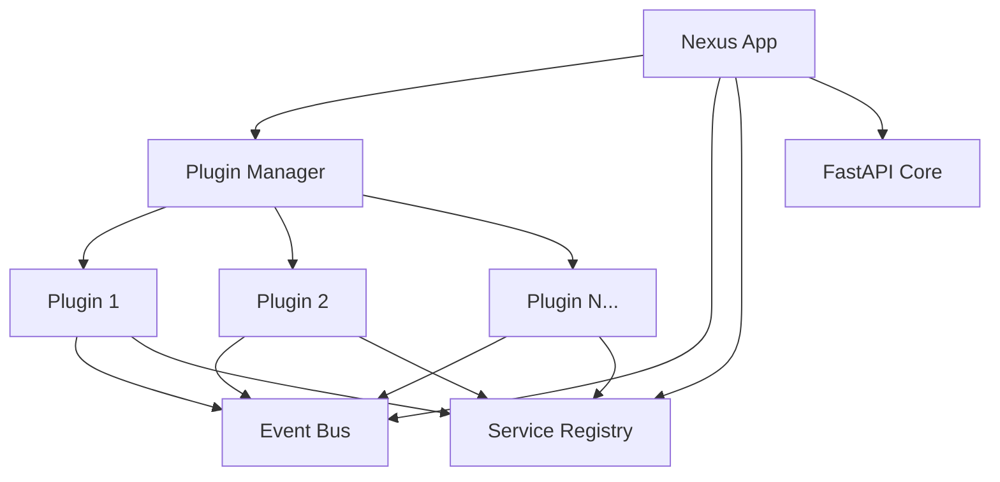

# Nexus

[](https://badge.fury.io/py/nexus)
[](https://www.python.org/downloads/)
[](https://opensource.org/licenses/MIT)

**The Ultimate Plugin-Based Application Platform** - Build modular, scalable applications with ease.

Nexus revolutionizes application development by making **everything a plugin**. Create applications as collections of focused, reusable plugins that work together seamlessly.

## ✨ Key Features

- **🔌 Pure Plugin Architecture** - Every feature is a plugin, ensuring complete modularity
- **🔥 Hot-Reload Support** - Add, update, or remove plugins without restarting
- **🎯 FastAPI Integration** - Modern async web framework with automatic OpenAPI docs
- **🛡️ Built-in Authentication** - JWT-based auth with role-based access control
- **📊 Multi-Database Support** - SQLAlchemy integration with PostgreSQL, MySQL, SQLite
- **🌐 API-First Design** - Automatic REST API generation with Swagger UI
- **⚡ High Performance** - Async/await throughout with optimized request handling
- **📈 Monitoring & Metrics** - Health checks, metrics collection, and observability
- **🔧 CLI Tools** - Powerful command-line interface for development and deployment

## 🚀 Quick Start

### Installation

```bash
pip install nexus
```

### Create Your First Application

```python
from nexus import create_nexus_app

app = create_nexus_app(
    title="My App",
    description="Built with Nexus",
    version="1.0.0"
)

if __name__ == "__main__":
    import uvicorn
    uvicorn.run(app, host="0.0.0.0", port=8000)
```

Your application runs at `http://localhost:8000` with:
- **API Docs**: `http://localhost:8000/docs`
- **Health Check**: `http://localhost:8000/health`

### Create Your First Plugin

```bash
nexus plugin create my_plugin
```

```python
from nexus import BasePlugin
from fastapi import APIRouter

class MyPlugin(BasePlugin):
    def __init__(self):
        super().__init__()
        self.name = "my_plugin"
        self.version = "1.0.0"
    
    async def initialize(self) -> bool:
        self.logger.info("Plugin initialized!")
        return True
    
    def get_api_routes(self):
        router = APIRouter(prefix="/my-plugin", tags=["my-plugin"])
        
        @router.get("/")
        async def get_info():
            return {"plugin": self.name, "status": "active"}
        
        return [router]

def create_plugin():
    return MyPlugin()
```

## 📚 Documentation

### 🚀 Getting Started
- **[Installation](docs/getting-started/installation.md)** - Install Nexus in 2 minutes
- **[Quick Start](docs/getting-started/quickstart.md)** - Build your first app in 5 minutes
- **[First Plugin](docs/getting-started/first-plugin.md)** - Create your first plugin
- **[Configuration](docs/getting-started/configuration.md)** - Configure your application

### 🏗️ Architecture & Development
- **[Architecture Overview](docs/architecture/overview.md)** - System design and principles
- **[Plugin Basics](docs/plugins/basics.md)** - Build powerful plugins
- **[API Routes](docs/plugins/api-routes.md)** - Create REST endpoints
- **[Database Integration](docs/plugins/database.md)** - Data persistence

### 📚 Complete Documentation
- **[Documentation Index](docs/README.md)** - Full documentation structure
- **[API Reference](docs/api/README.md)** - Complete framework reference
- **[Deployment Guide](docs/deployment/README.md)** - Production deployment

## 🏗️ Architecture



## 🔧 CLI Tools

```bash
# Application management
nexus run --host 0.0.0.0 --port 8000
nexus init
nexus status
nexus health

# Plugin management
nexus plugin create <name>
nexus plugin list
nexus plugin info <name>

# Admin tools
nexus-admin system info
nexus-admin user create <username>
nexus-admin plugin status
```

## 📁 Project Structure

```
my-nexus-app/
├── main.py                    # Application entry point
├── nexus_config.yaml          # Configuration file
├── nexus/                     # Nexus framework core
├── plugins/                   # Plugin directory
├── plugin_template/           # Plugin development template
├── config/                    # Configuration files
└── pyproject.toml            # Package configuration
```

## 🌟 Core Components

### Plugin Manager
Handles plugin lifecycle, loading, and dependency management with hot-reload support.

### Event Bus
Asynchronous publish-subscribe system for loose coupling between plugins.

### Service Registry
Dependency injection container for sharing services between plugins.

### Authentication Manager
JWT-based authentication with role-based access control.

### Database Adapter
Multi-database support with connection pooling and transaction management.

## 🤝 Contributing

We welcome contributions! Here's how to get started:

```bash
# Clone repository
git clone https://github.com/nexus-team/nexus.git
cd nexus

# Set up development environment
python -m venv .venv
source .venv/bin/activate  # On Windows: .venv\Scripts\activate

# Install dependencies
poetry install

# Run development server
python main.py
```

## 📄 License

This project is licensed under the MIT License - see the [LICENSE](LICENSE) file for details.

## 🔗 Links

- **PyPI Package**: https://pypi.org/project/nexus/
- **GitHub Repository**: https://github.com/nexus-team/nexus
- **Issue Tracker**: https://github.com/nexus-team/nexus/issues
- **Discussions**: https://github.com/nexus-team/nexus/discussions

## 🙏 Acknowledgments

- Built with [FastAPI](https://fastapi.tiangolo.com/)
- Powered by [SQLAlchemy](https://www.sqlalchemy.org/)
- CLI built with [Click](https://click.palletsprojects.com/)

---

**Made with ❤️ by the Nexus Team**

*Start building your next great application with Nexus today!*