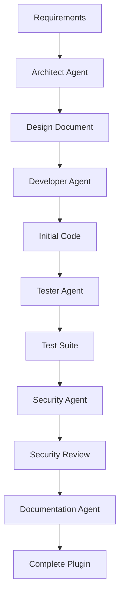

# AI Agents for Nexus Framework Development

## Table of Contents

1. [Introduction](#introduction)
2. [AI Agent Roles](#ai-agent-roles)
3. [Development Prompts](#development-prompts)
4. [Agent Workflows](#agent-workflows)
5. [Best Practices](#best-practices)
6. [Integration Examples](#integration-examples)
7. [Prompt Templates](#prompt-templates)
8. [Advanced Techniques](#advanced-techniques)

## Introduction

AI Agents can dramatically accelerate your development with Nexus Framework. This guide provides comprehensive prompts, workflows, and best practices for leveraging AI assistants in your development process.

### Benefits of AI-Assisted Development

- **🚀 10x Faster Development**: Generate boilerplate code instantly
- **🐛 Reduced Bugs**: AI can spot common issues before they happen
- **📚 Better Documentation**: Generate comprehensive docs automatically
- **🧪 Test Generation**: Create test suites quickly
- **🔄 Refactoring**: Safely refactor code with AI assistance
- **💡 Design Patterns**: Get suggestions for best practices

## AI Agent Roles

### 1. The Architect Agent

**Role**: System design and architecture decisions

**Prompt Template**:
```
You are a senior software architect specializing in plugin-based architectures.
I'm building a [DOMAIN] plugin for Nexus Framework that needs to [REQUIREMENTS].

Please provide:
1. High-level architecture design
2. Database schema recommendations
3. API endpoint structure
4. Event-driven communication patterns
5. Security considerations
6. Performance optimization strategies

Context:
- Plugin category: [CATEGORY]
- Expected load: [LOAD_DETAILS]
- Integration requirements: [INTEGRATIONS]
- Data volume: [DATA_VOLUME]
```

### 2. The Developer Agent

**Role**: Code generation and implementation

**Prompt Template**:
```
You are an expert Python developer working with Nexus Framework.
Generate a complete plugin implementation for [PLUGIN_NAME] that:

Requirements:
- [REQUIREMENT_1]
- [REQUIREMENT_2]
- [REQUIREMENT_3]

The plugin should follow Nexus Framework conventions:
1. Inherit from BasePlugin
2. Implement all required lifecycle methods
3. Include proper error handling
4. Add comprehensive logging
5. Follow PEP 8 style guidelines

Generate:
- plugin.py (main plugin class)
- models/schemas.py (Pydantic models)
- services/domain_service.py (business logic)
- api/routes.py (FastAPI endpoints)
- manifest.json (plugin metadata)
```

### 3. The Tester Agent

**Role**: Test generation and quality assurance

**Prompt Template**:
```
You are a QA engineer specializing in Python testing.
Generate comprehensive tests for the following Nexus Framework plugin:

[PASTE_PLUGIN_CODE]

Create:
1. Unit tests for all methods
2. Integration tests for API endpoints
3. Mock implementations for dependencies
4. Performance test scenarios
5. Edge case coverage

Use pytest and follow these conventions:
- Async test functions where needed
- Proper fixtures for setup/teardown
- Mock external dependencies
- Assert both success and failure cases
- Include docstrings for test purposes
```

### 4. The Documentation Agent

**Role**: Documentation and API specification

**Prompt Template**:
```
You are a technical writer specializing in developer documentation.
Create comprehensive documentation for this Nexus Framework plugin:

[PASTE_PLUGIN_CODE]

Generate:
1. README.md with:
   - Overview and features
   - Installation instructions
   - Configuration guide
   - Usage examples
   - API reference
   - Troubleshooting section

2. API documentation following OpenAPI spec
3. Code comments and docstrings
4. Configuration schema documentation
5. Migration guide from version X to Y
```

### 5. The Security Agent

**Role**: Security analysis and recommendations

**Prompt Template**:
```
You are a security expert reviewing Nexus Framework plugins.
Analyze this plugin for security vulnerabilities:

[PASTE_PLUGIN_CODE]

Check for:
1. SQL injection vulnerabilities
2. XSS attack vectors
3. Authentication/authorization issues
4. Data validation problems
5. Sensitive data exposure
6. Rate limiting requirements
7. CORS configuration issues
8. Dependency vulnerabilities

Provide:
- List of vulnerabilities found
- Severity ratings
- Recommended fixes with code examples
- Security best practices specific to this plugin
```

## Development Prompts

### Plugin Generation Prompts

#### Basic Plugin
```
Create a basic Nexus Framework plugin called "hello_world" that:
- Has a single endpoint returning a greeting
- Accepts a name parameter
- Logs all requests
- Includes proper error handling
```

#### Business Logic Plugin
```
Create a complete e-commerce order management plugin for Nexus Framework with:
- Order CRUD operations
- Order status workflow (pending → processing → shipped → delivered)
- Customer association
- Product inventory integration
- Payment processing hooks
- Email notification events
- Admin dashboard components
```

#### Integration Plugin
```
Create a Stripe payment integration plugin for Nexus Framework that:
- Handles payment processing
- Manages subscriptions
- Processes webhooks
- Stores transaction history
- Provides refund capabilities
- Includes PCI compliance considerations
```

### Code Review Prompts

```
Review this Nexus Framework plugin code for:
1. Code quality and style issues
2. Performance bottlenecks
3. Security vulnerabilities
4. Missing error handling
5. Opportunities for refactoring
6. Test coverage gaps

[PASTE_CODE]

Provide specific suggestions with code examples.
```

### Optimization Prompts

```
Optimize this Nexus Framework plugin for performance:

[PASTE_CODE]

Focus on:
1. Database query optimization
2. Caching opportunities
3. Async operation improvements
4. Memory usage reduction
5. API response time optimization
6. Background task offloading
```

## Agent Workflows

### Workflow 1: Complete Plugin Development



**Step-by-Step Process**:

1. **Define Requirements**
   ```
   I need a plugin for [DOMAIN] that handles [FEATURES].
   Users should be able to [USER_STORIES].
   ```

2. **Architecture Design**
   ```
   Based on these requirements, design the architecture for a Nexus plugin.
   Include database schema, API structure, and component interactions.
   ```

3. **Code Generation**
   ```
   Implement the plugin based on this architecture.
   Follow Nexus Framework best practices and include all necessary files.
   ```

4. **Test Creation**
   ```
   Generate comprehensive tests for this plugin implementation.
   Include unit, integration, and performance tests.
   ```

5. **Security Review**
   ```
   Review the implementation for security issues.
   Provide fixes for any vulnerabilities found.
   ```

6. **Documentation**
   ```
   Create complete documentation for this plugin.
   Include user guide, API docs, and developer notes.
   ```

### Workflow 2: Plugin Enhancement

```
Current Plugin Analysis → Feature Addition → Code Refactoring → 
Test Updates → Documentation Updates → Release
```

### Workflow 3: Bug Fixing

```
Bug Report → Root Cause Analysis → Fix Generation → 
Test Case Addition → Verification → Documentation Update
```

## Best Practices

### 1. Iterative Development

Start with simple prompts and iterate:

```
Initial: "Create a user management plugin"
     ↓
Better: "Create a user management plugin with CRUD operations"
     ↓
Best: "Create a user management plugin for Nexus Framework with:
      - User CRUD operations with pagination
      - Role-based access control
      - JWT authentication
      - Password reset via email
      - Account activation workflow
      - Audit logging
      - Rate limiting on auth endpoints"
```

### 2. Context Providing

Always provide sufficient context:

```
Context: I'm building a multi-tenant SaaS application using Nexus Framework.
Current plugins: auth_plugin, billing_plugin, notification_plugin
Database: PostgreSQL
Deployment: Kubernetes on AWS

Task: Create a tenant management plugin that integrates with existing plugins.
```

### 3. Code Review Loops

Use AI for continuous code review:

```python
# After each implementation:
prompt = f"""
Review this code change for:
- Consistency with existing codebase
- Performance implications
- Security concerns
- Test coverage

Diff:
{git_diff}

Existing patterns:
{codebase_patterns}
"""
```

## Integration Examples

### GitHub Copilot Integration

```python
# .github/copilot-instructions.md
You are developing plugins for Nexus Framework.
Always:
- Inherit from BasePlugin
- Implement lifecycle methods
- Use async/await for I/O operations
- Include type hints
- Add comprehensive error handling
- Follow the project's naming conventions
```

### CI/CD Integration

```yaml
# .github/workflows/ai-review.yml
name: AI Code Review
on: [pull_request]

jobs:
  ai-review:
    runs-on: ubuntu-latest
    steps:
      - uses: actions/checkout@v2
      - name: AI Review
        run: |
          # Use AI API to review changes
          python scripts/ai_review.py --diff "${{ github.event.pull_request.diff_url }}"
```

### IDE Integration

```json
// .vscode/settings.json
{
  "ai-assistant.prompts": {
    "nexus-plugin": "Generate a Nexus Framework plugin that ${input}",
    "nexus-test": "Create tests for this Nexus plugin: ${selectedText}",
    "nexus-docs": "Document this Nexus plugin code: ${selectedText}"
  }
}
```

## Prompt Templates

### Plugin Scaffolding

```
Generate a complete Nexus Framework plugin scaffold for a [DOMAIN] plugin:

Structure:
nexus-plugin-[NAME]/
├── plugin.py
├── manifest.json
├── requirements.txt
├── README.md
├── LICENSE
├── models/
│   ├── __init__.py
│   ├── entities.py
│   └── schemas.py
├── services/
│   ├── __init__.py
│   └── [NAME]_service.py
├── repositories/
│   ├── __init__.py
│   └── [NAME]_repository.py
├── api/
│   ├── __init__.py
│   └── routes.py
├── events/
│   ├── __init__.py
│   └── handlers.py
├── tests/
│   ├── test_plugin.py
│   ├── test_service.py
│   └── test_api.py
└── docs/
    └── api.md

Include starter code for each file following Nexus conventions.
```

### API Endpoint Generation

```
Generate FastAPI routes for a Nexus plugin that manages [RESOURCE]:

Operations needed:
- List with pagination and filtering
- Get by ID
- Create with validation
- Update (full and partial)
- Delete with cascade options
- Bulk operations
- Export/Import
- Search functionality

Include:
- Proper HTTP status codes
- Error handling
- Request/response models
- Authentication decorators
- Rate limiting
- API documentation
```

### Database Model Generation

```
Create database models for a [DOMAIN] plugin:

Entities:
- [ENTITY_1]: [DESCRIPTION]
- [ENTITY_2]: [DESCRIPTION]

Requirements:
- Relationships between entities
- Indexes for performance
- Validation rules
- Audit fields (created_at, updated_at, created_by)
- Soft delete support
- Version tracking

Generate:
1. Pydantic schemas
2. Database migration
3. Repository interfaces
4. Query builders
```

### Event Handler Generation

```
Create event handlers for a plugin that needs to:

Listen to:
- [EVENT_1]: [ACTION_TO_TAKE]
- [EVENT_2]: [ACTION_TO_TAKE]

Publish:
- [EVENT_3]: When [CONDITION]
- [EVENT_4]: When [CONDITION]

Include:
- Error recovery
- Retry logic
- Dead letter queue handling
- Event validation
- Idempotency checks
```

## Advanced Techniques

### 1. Chain-of-Thought Prompting

```
Let's build a complex plugin step by step.

Step 1: First, let's understand the requirements...
Step 2: Now, let's design the data model...
Step 3: Next, we'll implement the business logic...
Step 4: Then, we'll create the API layer...
Step 5: Finally, we'll add tests and documentation...

[Detailed implementation for each step]
```

### 2. Few-Shot Learning

```
Here are examples of good Nexus plugins:

Example 1: [CODE_EXAMPLE_1]
Example 2: [CODE_EXAMPLE_2]

Now create a similar plugin for [NEW_DOMAIN] following these patterns.
```

### 3. Role-Playing

```
You are a senior developer reviewing a junior's code.
The junior has submitted this Nexus plugin: [CODE]

Provide mentoring feedback that:
- Explains why certain patterns are better
- Shows improved implementations
- Teaches best practices
- Encourages good habits
```

### 4. Iterative Refinement

```
Initial: Generate a basic CRUD plugin
Refine 1: Add validation and error handling
Refine 2: Implement caching layer
Refine 3: Add event publishing
Refine 4: Include monitoring and metrics
Refine 5: Optimize for performance
```

### 5. Cross-Functional Collaboration

```
Simulate a discussion between:
- Backend Developer (focusing on API design)
- Frontend Developer (focusing on usability)
- DevOps Engineer (focusing on deployment)
- Security Expert (focusing on vulnerabilities)

Topic: Designing a new authentication plugin for Nexus Framework

Generate the discussion and final consensus.
```

## AI-Powered Development Tools

### 1. Plugin Generator CLI

```python
# nexus_ai_cli.py
import openai

def generate_plugin(description):
    prompt = f"""
    Generate a complete Nexus Framework plugin based on:
    {description}
    
    Include all necessary files and follow best practices.
    """
    
    response = openai.Completion.create(
        engine="gpt-4",
        prompt=prompt,
        max_tokens=4000
    )
    
    return response.choices[0].text

# Usage
# python nexus_ai_cli.py "Create a blog plugin with comments"
```

### 2. Automatic Test Generator

```python
def generate_tests(plugin_code):
    prompt = f"""
    Generate comprehensive tests for this Nexus plugin:
    {plugin_code}
    
    Create unit and integration tests with >90% coverage.
    """
    # AI generates tests
```

### 3. Documentation Generator

```python
def generate_docs(plugin_path):
    prompt = f"""
    Generate complete documentation for the Nexus plugin at:
    {plugin_path}
    
    Include API docs, user guide, and examples.
    """
    # AI generates documentation
```

## Conclusion

AI Agents are powerful allies in Nexus Framework development. By using the prompts, workflows, and techniques in this guide, you can:

- **Accelerate Development**: Generate code 10x faster
- **Improve Quality**: Catch bugs before production
- **Enhance Documentation**: Keep docs always up-to-date
- **Learn Best Practices**: Get expert guidance instantly
- **Iterate Quickly**: Try multiple approaches rapidly

Remember: AI is a tool to augment your capabilities, not replace your expertise. Always review, test, and understand the code that AI generates.

### Quick Start Checklist

- [ ] Set up your AI development environment
- [ ] Create prompt templates for your domain
- [ ] Integrate AI into your development workflow
- [ ] Build your first plugin with AI assistance
- [ ] Iterate and refine based on results
- [ ] Share your prompts with the team
- [ ] Contribute improvements back to the community

Happy coding with AI! 🚀🤖