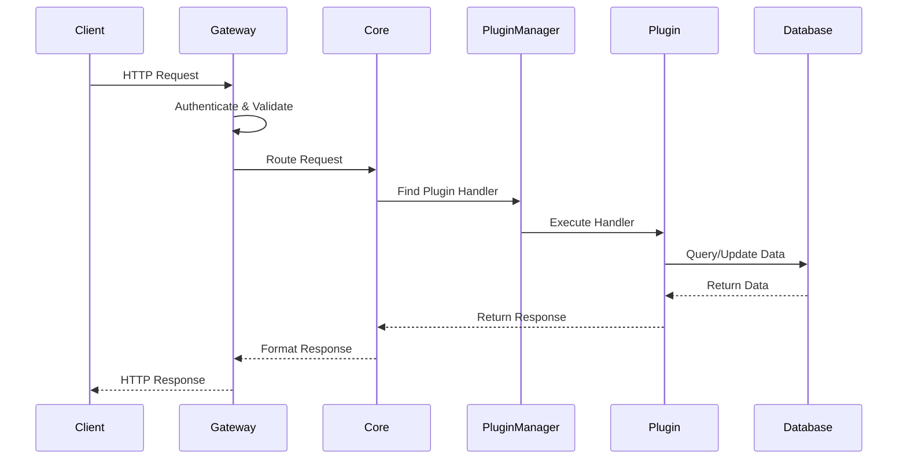

# Nexus Framework Architecture

## Table of Contents

1. [Overview](#overview)
2. [Core Principles](#core-principles)
3. [System Architecture](#system-architecture)
4. [Component Architecture](#component-architecture)
5. [Plugin Architecture](#plugin-architecture)
6. [Database Architecture](#database-architecture)
7. [API Architecture](#api-architecture)
8. [Security Architecture](#security-architecture)
9. [Scalability & Performance](#scalability--performance)
10. [Technical Stack](#technical-stack)

## Overview

Nexus Framework is built on a **pure plugin architecture** where the core application provides only essential infrastructure services, and all business functionality is delivered through plugins. This design ensures maximum flexibility, maintainability, and scalability.

### Architecture Goals

- **Complete Modularity**: Every feature is a plugin
- **Zero Coupling**: Core and plugins are completely isolated
- **Domain Isolation**: Each plugin owns its domain completely
- **Hot-Swappable**: Plugins can be loaded/unloaded at runtime
- **Technology Agnostic**: Support multiple databases, services, and protocols
- **Cloud-Native**: Designed for containerized and serverless deployments

## Core Principles

### 1. Clean Architecture

```
┌─────────────────────────────────────────────────────────┐
│                    External Layer                        │
│  (Web UI, Mobile Apps, External Services)               │
├─────────────────────────────────────────────────────────┤
│                    Interface Layer                       │
│  (REST API, GraphQL, WebSocket, gRPC)                  │
├─────────────────────────────────────────────────────────┤
│                    Application Layer                     │
│  (Use Cases, Application Services, DTOs)               │
├─────────────────────────────────────────────────────────┤
│                    Domain Layer                          │
│  (Entities, Value Objects, Domain Services)            │
├─────────────────────────────────────────────────────────┤
│                    Infrastructure Layer                  │
│  (Database, File System, External APIs)                │
└─────────────────────────────────────────────────────────┘
```

### 2. Domain-Driven Design (DDD)

Each plugin represents a **bounded context** with:
- **Aggregates**: Core business entities
- **Value Objects**: Immutable domain concepts
- **Domain Services**: Business logic
- **Repositories**: Data access abstractions
- **Domain Events**: Inter-plugin communication

### 3. Hexagonal Architecture

```
         ┌──────────────────────────────┐
         │      Application Core        │
         │                              │
    ┌────┤  ┌──────────────────────┐  ├────┐
    │    │  │   Business Logic     │  │    │
    │    │  │   Domain Models      │  │    │
Port│    │  │   Use Cases          │  │    │Port
    │    │  └──────────────────────┘  │    │
    │    │                              │    │
    │    └──────────────────────────────┘    │
    │                                        │
Adapter                                  Adapter
┌───┴────┐                            ┌─────┴───┐
│  API   │                            │Database │
│Adapter │                            │ Adapter │
└────────┘                            └─────────┘
```

### 4. SOLID Principles

- **Single Responsibility**: Each component has one reason to change
- **Open/Closed**: Open for extension (plugins), closed for modification (core)
- **Liskov Substitution**: Plugins are interchangeable through interfaces
- **Interface Segregation**: Small, focused interfaces
- **Dependency Inversion**: Depend on abstractions, not implementations

## System Architecture

### High-Level Architecture

```
┌──────────────────────────────────────────────────────────────┐
│                        Load Balancer                          │
└────────────────────────┬─────────────────────────────────────┘
                         │
┌────────────────────────┴─────────────────────────────────────┐
│                    API Gateway Layer                          │
│  ┌──────────┐  ┌──────────┐  ┌──────────┐  ┌──────────┐    │
│  │   Auth   │  │   Rate   │  │   CORS   │  │  Routing │    │
│  │  Filter  │  │  Limiter │  │  Handler │  │  Engine  │    │
│  └──────────┘  └──────────┘  └──────────┘  └──────────┘    │
└────────────────────────┬─────────────────────────────────────┘
                         │
┌────────────────────────┴─────────────────────────────────────┐
│                    Core Framework                             │
│  ┌──────────────┐  ┌──────────────┐  ┌──────────────┐      │
│  │   Plugin     │  │   Event      │  │   Dependency │      │
│  │   Manager    │  │   Bus        │  │   Injection  │      │
│  └──────────────┘  └──────────────┘  └──────────────┘      │
│  ┌──────────────┐  ┌──────────────┐  ┌──────────────┐      │
│  │   Database   │  │   Cache      │  │   Message    │      │
│  │   Adapter    │  │   Manager    │  │   Queue      │      │
│  └──────────────┘  └──────────────┘  └──────────────┘      │
└────────────────────────┬─────────────────────────────────────┘
                         │
┌────────────────────────┴─────────────────────────────────────┐
│                    Plugin Ecosystem                           │
│  ┌──────────┐  ┌──────────┐  ┌──────────┐  ┌──────────┐    │
│  │Plugin A  │  │Plugin B  │  │Plugin C  │  │Plugin D  │    │
│  └──────────┘  └──────────┘  └──────────┘  └──────────┘    │
└────────────────────────┬─────────────────────────────────────┘
                         │
┌────────────────────────┴─────────────────────────────────────┐
│                    Data Layer                                 │
│  ┌──────────┐  ┌──────────┐  ┌──────────┐  ┌──────────┐    │
│  │ MongoDB  │  │PostgreSQL│  │  Redis   │  │   S3     │    │
│  └──────────┘  └──────────┘  └──────────┘  └──────────┘    │
└───────────────────────────────────────────────────────────────┘
```

### Component Interaction



## Component Architecture

### Core Components

#### 1. Application Core

```python
class NexusApplication:
    """Main application container."""
    
    def __init__(self, config: AppConfig):
        self.config = config
        self.plugin_manager = PluginManager()
        self.event_bus = EventBus()
        self.db_adapter = DatabaseAdapter(config.database)
        self.auth_manager = AuthenticationManager()
        self.api_gateway = APIGateway()
    
    async def startup(self):
        """Initialize application components."""
        await self.db_adapter.connect()
        await self.plugin_manager.discover_plugins()
        await self.plugin_manager.load_enabled_plugins()
        self.api_gateway.register_plugin_routes()
    
    async def shutdown(self):
        """Cleanup application resources."""
        await self.plugin_manager.shutdown_all()
        await self.db_adapter.disconnect()
```

#### 2. Plugin Manager

```python
class PluginManager:
    """Manages plugin lifecycle and operations."""
    
    async def discover_plugins(self) -> List[PluginInfo]:
        """Discover available plugins."""
        
    async def load_plugin(self, plugin_id: str) -> bool:
        """Load and initialize a plugin."""
        
    async def unload_plugin(self, plugin_id: str) -> bool:
        """Unload and cleanup a plugin."""
        
    def get_plugin_routes(self) -> List[APIRouter]:
        """Get all plugin API routes."""
        
    async def handle_plugin_event(self, event: PluginEvent):
        """Handle inter-plugin communication."""
```

#### 3. Event Bus

```python
class EventBus:
    """Manages asynchronous event-driven communication."""
    
    async def publish(self, event: Event):
        """Publish an event to subscribers."""
        
    def subscribe(self, event_type: str, handler: Callable):
        """Subscribe to specific event types."""
        
    async def process_events(self):
        """Process queued events."""
```

#### 4. Database Adapter

```python
class DatabaseAdapter:
    """Abstracts database operations."""
    
    def __init__(self, config: DatabaseConfig):
        self.backend = self._create_backend(config)
    
    async def get(self, path: str) -> Any:
        """Retrieve data from database."""
        
    async def set(self, path: str, value: Any):
        """Store data in database."""
        
    async def query(self, filter: Dict) -> List[Any]:
        """Query database with filters."""
        
    async def transaction(self, operations: List[Operation]):
        """Execute atomic transactions."""
```

## Plugin Architecture

### Plugin Structure

```
plugin/
├── __init__.py           # Plugin exports
├── plugin.py            # Main plugin class
├── manifest.json        # Plugin metadata
├── models/              # Domain models
│   ├── entities.py     # Business entities
│   └── schemas.py      # Request/response schemas
├── services/            # Business logic
│   ├── domain.py       # Domain services
│   └── application.py  # Application services
├── repositories/        # Data access
│   └── repository.py   # Repository implementations
├── api/                 # API endpoints
│   └── routes.py       # FastAPI routes
├── events/              # Event handlers
│   ├── publishers.py   # Event publishers
│   └── subscribers.py  # Event subscribers
├── ui/                  # UI components
│   ├── templates/      # HTML templates
│   └── static/         # Static assets
└── tests/               # Plugin tests
    ├── unit/           # Unit tests
    └── integration/    # Integration tests
```

### Plugin Interface

```python
from abc import ABC, abstractmethod
from typing import Dict, List, Any, Optional

class PluginInterface(ABC):
    """Base interface for all plugins."""
    
    @abstractmethod
    async def initialize(self) -> bool:
        """Initialize plugin resources."""
        pass
    
    @abstractmethod
    async def shutdown(self) -> None:
        """Cleanup plugin resources."""
        pass
    
    @abstractmethod
    def get_api_routes(self) -> List[APIRouter]:
        """Return plugin API routes."""
        pass
    
    @abstractmethod
    def get_database_schema(self) -> Dict[str, Any]:
        """Return plugin database schema."""
        pass
    
    @abstractmethod
    def get_event_handlers(self) -> Dict[str, Callable]:
        """Return event handlers."""
        pass
    
    @abstractmethod
    def get_ui_components(self) -> Dict[str, Component]:
        """Return UI components."""
        pass
    
    @abstractmethod
    async def health_check(self) -> HealthStatus:
        """Check plugin health status."""
        pass
```

### Plugin Categories

```python
class BusinessPlugin(PluginInterface):
    """Base class for business logic plugins."""
    category = "business"

class IntegrationPlugin(PluginInterface):
    """Base class for integration plugins."""
    category = "integration"

class AnalyticsPlugin(PluginInterface):
    """Base class for analytics plugins."""
    category = "analytics"

class SecurityPlugin(PluginInterface):
    """Base class for security plugins."""
    category = "security"
```

### Plugin Communication

#### Event-Driven Communication

```python
# Plugin A publishes an event
class OrderPlugin(BusinessPlugin):
    async def create_order(self, order_data: OrderSchema):
        order = await self.order_service.create(order_data)
        
        # Publish event for other plugins
        await self.event_bus.publish(
            OrderCreatedEvent(
                order_id=order.id,
                customer_id=order.customer_id,
                total=order.total
            )
        )

# Plugin B subscribes to the event
class InventoryPlugin(BusinessPlugin):
    def __init__(self):
        self.event_bus.subscribe(
            "OrderCreatedEvent",
            self.handle_order_created
        )
    
    async def handle_order_created(self, event: OrderCreatedEvent):
        # Update inventory based on order
        await self.inventory_service.reserve_items(event.order_id)
```

#### Service Discovery

```python
class PluginRegistry:
    """Central registry for plugin services."""
    
    def register_service(self, name: str, service: Any):
        """Register a plugin service."""
        
    def get_service(self, name: str) -> Optional[Any]:
        """Get a registered service."""
        
    def discover_services(self, interface: Type) -> List[Any]:
        """Discover services implementing an interface."""
```

## Database Architecture

### Multi-Tenant Database Design

```
nexus_db/
├── core/                    # Core framework data
│   ├── users/              # User accounts
│   ├── roles/              # RBAC roles
│   ├── permissions/        # Permissions
│   └── settings/           # System settings
├── plugins/                 # Plugin data namespace
│   ├── {category}/         # Plugin category
│   │   └── {plugin_name}/  # Individual plugin data
│   │       ├── config/     # Plugin configuration
│   │       ├── data/       # Plugin business data
│   │       └── metadata/   # Plugin metadata
└── shared/                  # Shared data space
    ├── cache/              # Cached data
    └── events/             # Event store
```

### Database Abstraction Layer

```python
class DatabaseBackend(ABC):
    """Abstract database backend interface."""
    
    @abstractmethod
    async def connect(self) -> None:
        """Establish database connection."""
    
    @abstractmethod
    async def disconnect(self) -> None:
        """Close database connection."""
    
    @abstractmethod
    async def get(self, key: str) -> Any:
        """Get value by key."""
    
    @abstractmethod
    async def set(self, key: str, value: Any) -> None:
        """Set value for key."""
    
    @abstractmethod
    async def delete(self, key: str) -> None:
        """Delete key."""
    
    @abstractmethod
    async def query(self, collection: str, filter: Dict) -> List[Any]:
        """Query collection with filter."""

class MongoDBBackend(DatabaseBackend):
    """MongoDB implementation."""
    
class PostgreSQLBackend(DatabaseBackend):
    """PostgreSQL implementation."""
    
class RedisBackend(DatabaseBackend):
    """Redis implementation for caching."""
```

### Repository Pattern

```python
from typing import Generic, TypeVar, List, Optional

T = TypeVar('T')

class Repository(Generic[T], ABC):
    """Generic repository interface."""
    
    @abstractmethod
    async def get(self, id: str) -> Optional[T]:
        """Get entity by ID."""
    
    @abstractmethod
    async def list(self, filter: Dict = None) -> List[T]:
        """List entities with optional filter."""
    
    @abstractmethod
    async def create(self, entity: T) -> T:
        """Create new entity."""
    
    @abstractmethod
    async def update(self, id: str, entity: T) -> T:
        """Update existing entity."""
    
    @abstractmethod
    async def delete(self, id: str) -> bool:
        """Delete entity."""

class PluginRepository(Repository[T]):
    """Plugin-specific repository implementation."""
    
    def __init__(self, db_adapter: DatabaseAdapter, plugin_path: str):
        self.db = db_adapter
        self.base_path = f"plugins.{plugin_path}"
    
    async def get(self, id: str) -> Optional[T]:
        data = await self.db.get(f"{self.base_path}.{id}")
        return self._deserialize(data) if data else None
```

## API Architecture

### RESTful API Design

```
GET    /api/{category}/{plugin}/resources      # List resources
POST   /api/{category}/{plugin}/resources      # Create resource
GET    /api/{category}/{plugin}/resources/{id} # Get resource
PUT    /api/{category}/{plugin}/resources/{id} # Update resource
DELETE /api/{category}/{plugin}/resources/{id} # Delete resource
PATCH  /api/{category}/{plugin}/resources/{id} # Partial update

# Batch operations
POST   /api/{category}/{plugin}/resources/batch # Batch create
PUT    /api/{category}/{plugin}/resources/batch # Batch update
DELETE /api/{category}/{plugin}/resources/batch # Batch delete

# Actions
POST   /api/{category}/{plugin}/resources/{id}/actions/{action}
```

### API Gateway

```python
class APIGateway:
    """Central API gateway for request routing."""
    
    def __init__(self):
        self.app = FastAPI()
        self.middleware_stack = MiddlewareStack()
    
    def register_middleware(self, middleware: Middleware):
        """Register middleware in the stack."""
        self.middleware_stack.add(middleware)
    
    def register_plugin_routes(self):
        """Register all plugin routes."""
        for plugin in self.plugin_manager.get_enabled_plugins():
            for router in plugin.get_api_routes():
                self.app.include_router(
                    router,
                    prefix=f"/api/{plugin.category}/{plugin.name}"
                )
```

### Request/Response Pipeline

```
Request → Middleware Stack → Router → Handler → Service → Repository → Database
                                                                           ↓
Client ← Middleware Stack ← Serializer ← Response ← Service ← Repository ←
```

### GraphQL Support

```python
from strawberry import Schema, type, field

@type
class PluginQuery:
    """GraphQL queries for plugins."""
    
    @field
    async def plugin(self, id: str) -> Plugin:
        return await plugin_service.get(id)
    
    @field
    async def plugins(self, category: str = None) -> List[Plugin]:
        return await plugin_service.list(category=category)

@type
class PluginMutation:
    """GraphQL mutations for plugins."""
    
    @field
    async def enable_plugin(self, id: str) -> Plugin:
        return await plugin_service.enable(id)

schema = Schema(query=PluginQuery, mutation=PluginMutation)
```

## Security Architecture

### Authentication Flow

```
┌──────────┐      ┌──────────┐      ┌──────────┐      ┌──────────┐
│  Client  │      │    API   │      │   Auth   │      │   User   │
│          │      │  Gateway │      │  Service │      │    DB    │
└────┬─────┘      └────┬─────┘      └────┬─────┘      └────┬─────┘
     │                 │                 │                 │
     │  POST /login    │                 │                 │
     ├────────────────►│                 │                 │
     │                 │  Validate       │                 │
     │                 ├────────────────►│                 │
     │                 │                 │  Query User    │
     │                 │                 ├────────────────►│
     │                 │                 │◄────────────────┤
     │                 │                 │  User Data     │
     │                 │◄────────────────┤                 │
     │                 │  Generate JWT   │                 │
     │◄────────────────┤                 │                 │
     │  JWT Token      │                 │                 │
     │                 │                 │                 │
```

### Authorization Model

```python
class Permission:
    """Granular permission definition."""
    resource: str  # e.g., "orders"
    action: str    # e.g., "create", "read", "update", "delete"
    scope: str     # e.g., "own", "team", "all"

class Role:
    """Role with permissions."""
    name: str
    permissions: List[Permission]
    
class RBAC:
    """Role-Based Access Control."""
    
    def has_permission(
        self,
        user: User,
        resource: str,
        action: str
    ) -> bool:
        """Check if user has permission."""
        for role in user.roles:
            for permission in role.permissions:
                if (permission.resource == resource and
                    permission.action == action):
                    return True
        return False
```

### Security Layers

1. **Network Security**
   - TLS/SSL encryption
   - IP whitelisting
   - DDoS protection

2. **Application Security**
   - Input validation
   - SQL injection prevention
   - XSS protection
   - CSRF tokens

3. **Plugin Security**
   - Sandboxed execution
   - Resource limits
   - Permission boundaries
   - Code signing

4. **Data Security**
   - Encryption at rest
   - Encryption in transit
   - Data masking
   - Audit logging

## Scalability & Performance

### Horizontal Scaling

```
        Load Balancer
             │
    ┌────────┼────────┐
    │        │        │
Instance1 Instance2 Instance3
    │        │        │
    └────────┼────────┘
             │
     Shared Database
      & Message Queue
```

### Caching Strategy

```python
class CacheManager:
    """Multi-level caching system."""
    
    def __init__(self):
        self.l1_cache = MemoryCache()      # In-memory cache
        self.l2_cache = RedisCache()       # Distributed cache
        self.l3_cache = CDNCache()         # Edge cache
    
    async def get(self, key: str) -> Optional[Any]:
        # Try L1 cache first
        if value := self.l1_cache.get(key):
            return value
        
        # Try L2 cache
        if value := await self.l2_cache.get(key):
            self.l1_cache.set(key, value)
            return value
        
        # Try L3 cache
        if value := await self.l3_cache.get(key):
            await self.l2_cache.set(key, value)
            self.l1_cache.set(key, value)
            return value
        
        return None
```

### Performance Optimization

1. **Database Optimization**
   - Connection pooling
   - Query optimization
   - Index management
   - Read replicas

2. **API Optimization**
   - Response compression
   - Pagination
   - Field filtering
   - Batch operations

3. **Plugin Optimization**
   - Lazy loading
   - Resource pooling
   - Async operations
   - Background tasks

### Monitoring & Observability

```python
class MetricsCollector:
    """Collect application metrics."""
    
    def record_request(self, endpoint: str, duration: float):
        """Record API request metrics."""
    
    def record_plugin_metric(self, plugin: str, metric: str, value: float):
        """Record plugin-specific metrics."""
    
    def record_database_query(self, query: str, duration: float):
        """Record database query metrics."""

class HealthCheck:
    """System health monitoring."""
    
    async def check_core(self) -> HealthStatus:
        """Check core system health."""
    
    async def check_plugins(self) -> Dict[str, HealthStatus]:
        """Check all plugin health."""
    
    async def check_dependencies(self) -> Dict[str, HealthStatus]:
        """Check external dependencies."""
```

## Technical Stack

### Core Technologies

- **Language**: Python 3.11+
- **Framework**: FastAPI
- **ASGI Server**: Uvicorn
- **Validation**: Pydantic
- **Testing**: pytest, pytest-asyncio
- **Documentation**: OpenAPI/Swagger

### Database Technologies

- **Primary**: MongoDB, PostgreSQL
- **Cache**: Redis
- **Search**: Elasticsearch
- **Time-Series**: InfluxDB

### Infrastructure

- **Container**: Docker, Kubernetes
- **CI/CD**: GitLab CI, GitHub Actions
- **Monitoring**: Prometheus, Grafana
- **Logging**: ELK Stack
- **Tracing**: Jaeger
- **Message Queue**: RabbitMQ, Kafka

### Development Tools

- **Code Quality**: Black, isort, mypy
- **Security**: bandit, safety
- **Documentation**: Sphinx, MkDocs
- **API Testing**: Postman, Insomnia

## Design Patterns

### Creational Patterns

- **Factory Pattern**: Plugin creation
- **Builder Pattern**: Complex object construction
- **Singleton Pattern**: Service instances
- **Prototype Pattern**: Configuration templates

### Structural Patterns

- **Adapter Pattern**: Database backends
- **Decorator Pattern**: Middleware stack
- **Facade Pattern**: Simplified plugin interfaces
- **Proxy Pattern**: Service proxies

### Behavioral Patterns

- **Observer Pattern**: Event system
- **Strategy Pattern**: Authentication strategies
- **Command Pattern**: API actions
- **Chain of Responsibility**: Request processing

### Domain Patterns

- **Repository Pattern**: Data access
- **Unit of Work**: Transactions
- **Specification Pattern**: Query building
- **Aggregate Pattern**: Domain models

## Deployment Architecture

### Container Architecture

```dockerfile
# Multi-stage build
FROM python:3.11-slim as builder
# Build stage

FROM python:3.11-slim
# Runtime stage
```

### Kubernetes Deployment

```yaml
apiVersion: apps/v1
kind: Deployment
metadata:
  name: nexus-app
spec:
  replicas: 3
  selector:
    matchLabels:
      app: nexus
  template:
    metadata:
      labels:
        app: nexus
    spec:
      containers:
      - name: nexus
        image: nexus-framework:latest
        ports:
        - containerPort: 8000
        env:
        - name: DATABASE_URL
          valueFrom:
            secretKeyRef:
              name: nexus-secrets
              key: database-url
```

### Service Mesh

```yaml
# Istio service mesh configuration
apiVersion: networking.istio.io/v1alpha3
kind: VirtualService
metadata:
  name: nexus-routing
spec:
  http:
  - match:
    - uri:
        prefix: /api/
    route:
    - destination:
        host: nexus-service
        port:
          number: 8000
```

## Conclusion

The Nexus Framework architecture provides a robust, scalable, and maintainable foundation for building modern applications. Its plugin-based design ensures that applications can evolve with changing requirements while maintaining clean separation of concerns and high code quality.

The architecture supports:
- **Rapid Development**: Through reusable plugins
- **Scalability**: Both horizontal and vertical
- **Maintainability**: Through clean architecture
- **Flexibility**: Through plugin system
- **Security**: Through multiple security layers
- **Performance**: Through optimization strategies

This architecture is production-ready and suitable for applications of any size, from small startups to large enterprises.