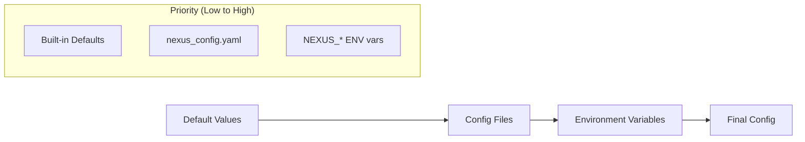

# Configuration Guide

Configure your Nexus Platform application for different environments and deployment scenarios.

## 🎯 Configuration Overview

Nexus uses a hierarchical configuration system that loads settings from multiple sources in order of priority:

1. **Default values** (lowest priority)
2. **Configuration files** (YAML/JSON)
3. **Environment variables** (highest priority)



## 📋 Prerequisites

- [Nexus Platform installed](installation.md)
- [Quick Start completed](quickstart.md)
- Basic understanding of YAML format

## 🔧 Basic Configuration

### Default Configuration File

Create `nexus_config.yaml` in your project root:

```yaml
# Application Settings
app:
    title: "My Nexus Application"
    description: "A modular application built with Nexus Platform"
    version: "1.0.0"
    debug: false

# Server Configuration
server:
    host: "0.0.0.0"
    port: 8000
    workers: 1

# CORS Configuration
cors:
    enabled: true
    allow_origins: ["*"]
    allow_credentials: true
    allow_methods: ["*"]
    allow_headers: ["*"]
    expose_headers: []
    max_age: 600

# Database Configuration
database:
    type: sqlite # sqlite, postgresql, mysql, mongodb, redis
    connection:
        host: "localhost"
        port: null # Uses default port for database type
        database: "nexus"
        username: null
        password: null
        path: "./nexus.db" # SQLite file path
    pool:
        min_size: 5
        max_size: 20
        max_overflow: 10
        pool_timeout: 30
        pool_recycle: 3600

# Cache Configuration
cache:
    enabled: true
    type: "memory" # memory, redis
    ttl: 300
    max_size: 1000
    redis_url: "redis://localhost:6379/1"

# Authentication Configuration
auth:
    jwt_secret: "your-secret-key-change-in-production"
    jwt_algorithm: "HS256"
    access_token_expire_minutes: 30
    refresh_token_expire_days: 7
    password_min_length: 8
    require_email_verification: false

# Security Settings
security:
    allowed_hosts: []
    trust_host_header: false
    enable_csrf: false
    csrf_secret: null

# Logging Configuration
logging:
    level: "INFO" # DEBUG, INFO, WARNING, ERROR, CRITICAL
    format: "%(asctime)s - %(name)s - %(levelname)s - %(message)s"
    file_path: null # Set to file path for file logging
    max_bytes: 10485760 # 10MB
    backup_count: 5

# Plugin Configuration
plugins:
    directories: ["plugins"]
    enabled: []
    disabled: []
    auto_discover: true
```

## 🌍 Environment-Specific Configurations

### Development Configuration

Create `config/development.yaml`:

```yaml
app:
    debug: true

server:
    port: 8000

database:
    type: sqlite
    connection:
        path: "./dev_nexus.db"

logging:
    level: "DEBUG"
    format: "%(asctime)s - %(name)s - %(levelname)s - %(message)s"

cors:
    allow_origins:
        - "http://localhost:3000"
        - "http://127.0.0.1:3000"
        - "http://localhost:8080"

plugins:
    auto_discover: true
```

### Production Configuration

Create `config/production.yaml`:

```yaml
app:
    debug: false

server:
    host: "0.0.0.0"
    port: 8000
    workers: 4

database:
    type: postgresql
    connection:
        host: "${DB_HOST}"
        port: 5432
        database: "${DB_NAME}"
        username: "${DB_USER}"
        password: "${DB_PASSWORD}"
    pool:
        min_size: 10
        max_size: 50
        max_overflow: 20

cache:
    type: redis
    redis_url: "${REDIS_URL}"
    ttl: 3600

auth:
    jwt_secret: "${JWT_SECRET}"
    access_token_expire_minutes: 60

security:
    allowed_hosts:
        - "yourdomain.com"
        - "*.yourdomain.com"
    trust_host_header: false

logging:
    level: "INFO"
    file_path: "/var/log/nexus/nexus.log"
    max_bytes: 52428800 # 50MB
    backup_count: 10

cors:
    allow_origins:
        - "https://yourdomain.com"
        - "https://app.yourdomain.com"
    allow_credentials: true

plugins:
    auto_discover: false
    enabled:
        - "user_management"
        - "analytics"
        - "monitoring"
```

### Testing Configuration

Create `config/testing.yaml`:

```yaml
app:
    debug: true

database:
    type: sqlite
    connection:
        path: ":memory:" # In-memory database for tests

cache:
    enabled: false

auth:
    jwt_secret: "test-secret-key"
    access_token_expire_minutes: 5

logging:
    level: "WARNING"
    format: "%(levelname)s - %(message)s"

plugins:
    auto_discover: false
    enabled: []
```

## 🔐 Environment Variables

### Required Environment Variables

```bash
# Production secrets (required in production)
export JWT_SECRET="your-super-secret-jwt-key-at-least-256-bits-long"
export DB_HOST="localhost"
export DB_NAME="nexus_prod"
export DB_USER="nexus_user"
export DB_PASSWORD="secure_password"
export REDIS_URL="redis://localhost:6379/0"

# Optional overrides
export NEXUS_DEBUG="false"
export NEXUS_LOG_LEVEL="INFO"
export NEXUS_HOST="0.0.0.0"
export NEXUS_PORT="8000"
```

### Environment Variable Mapping

Nexus automatically maps environment variables with the `NEXUS_` prefix:

- `NEXUS_DEBUG` → `app.debug`
- `NEXUS_HOST` → `server.host`
- `NEXUS_PORT` → `server.port`
- `NEXUS_LOG_LEVEL` → `logging.level`
- `NEXUS_DB_URL` → `database.url` (if provided)

### Using Environment Variables in Config Files

```yaml
# Use ${VAR_NAME} syntax in YAML files
database:
    connection:
        host: "${DB_HOST:localhost}" # Default value after colon
        port: "${DB_PORT:5432}"
        database: "${DB_NAME:nexus}"
        username: "${DB_USER}"
        password: "${DB_PASSWORD}"

auth:
    jwt_secret: "${JWT_SECRET}"

cache:
    redis_url: "${REDIS_URL:redis://localhost:6379/0}"
```

## 📦 Database Configuration

### SQLite (Development)

```yaml
database:
    type: sqlite
    connection:
        path: "./nexus.db"
```

### PostgreSQL (Production)

```yaml
database:
    type: postgresql
    connection:
        host: "localhost"
        port: 5432
        database: "nexus"
        username: "nexus_user"
        password: "secure_password"
    pool:
        min_size: 10
        max_size: 50
        max_overflow: 20
        pool_timeout: 30
        pool_recycle: 3600
```

### MySQL/MariaDB

```yaml
database:
    type: mysql
    connection:
        host: "localhost"
        port: 3306
        database: "nexus"
        username: "nexus_user"
        password: "secure_password"
```

### MongoDB

```yaml
database:
    type: mongodb
    connection:
        host: "localhost"
        port: 27017
        database: "nexus"
        username: "nexus_user"
        password: "secure_password"
```

### Redis

```yaml
database:
    type: redis
    connection:
        host: "localhost"
        port: 6379
        database: 0
        password: null
```

## 🔧 Loading Configuration

### Method 1: Automatic Loading

Nexus automatically loads `nexus_config.yaml` from the current directory:

```python
from nexus import create_nexus_app

# Automatically loads nexus_config.yaml if present
app = create_nexus_app(
    title="My App",
    description="My Nexus Application"
)
```

### Method 2: Explicit File Loading

```python
from nexus import create_nexus_app, load_config

# Load specific config file
config = load_config("config/production.yaml")

app = create_nexus_app(
    title="My App",
    config=config
)
```

### Method 3: Environment-Based Loading

```python
import os
from nexus import create_nexus_app, load_config

# Load config based on environment
env = os.getenv("NEXUS_ENV", "development")
config_file = f"config/{env}.yaml"

try:
    config = load_config(config_file)
except FileNotFoundError:
    config = None  # Use defaults

app = create_nexus_app(
    title="My App",
    config=config
)
```

### Method 4: Programmatic Configuration

```python
from nexus import create_nexus_app, AppConfig, DatabaseConfig, DatabaseType

# Create config programmatically
config = AppConfig()
config.app.title = "My App"
config.app.debug = True

# Configure database
config.database = DatabaseConfig()
config.database.type = DatabaseType.POSTGRESQL
config.database.connection.host = "localhost"
config.database.connection.database = "nexus"

app = create_nexus_app(config=config)
```

## 🔌 Plugin Configuration

### Plugin-Specific Settings

Add plugin configurations to your main config file:

```yaml
plugins:
    directories: ["plugins"]
    auto_discover: true
    enabled:
        - "hello_world"
        - "user_manager"
        - "file_upload"

    # Plugin-specific configuration
    hello_world:
        greeting_languages: ["en", "es", "fr"]
        max_messages: 1000

    user_manager:
        max_users: 10000
        require_email_verification: true
        password_min_length: 12

    file_upload:
        max_file_size: 10485760 # 10MB
        allowed_extensions: [".jpg", ".png", ".pdf", ".docx"]
        upload_path: "./uploads"
```

### Accessing Plugin Configuration

In your plugin code:

```python
from nexus.plugins import BasePlugin

class MyPlugin(BasePlugin):
    def __init__(self):
        super().__init__()
        self.name = "my_plugin"

    async def initialize(self) -> bool:
        # Access plugin configuration
        self.max_items = await self.get_config("max_items", 100)
        self.enable_cache = await self.get_config("enable_cache", True)

        # Use configuration values
        self.logger.info(f"Plugin configured with max_items={self.max_items}")

        return True
```

## 🏗️ Configuration Validation

### CLI Validation

```bash
# Validate configuration file
nexus validate

# Validate specific config file
nexus validate --config config/production.yaml

# Check configuration syntax
python -c "from nexus import load_config; load_config('nexus_config.yaml')"
```

### Programmatic Validation

```python
from nexus import load_config
from nexus.config import ConfigurationError

try:
    config = load_config("nexus_config.yaml")
    print("✓ Configuration is valid")
except ConfigurationError as e:
    print(f"✗ Configuration error: {e}")
except FileNotFoundError:
    print("✗ Configuration file not found")
```

## 🔄 Configuration Management

### Configuration Manager

The `ConfigurationManager` class provides advanced configuration features:

```python
from nexus.config import ConfigurationManager

# Create configuration manager
config_manager = ConfigurationManager()

# Load configuration
config = config_manager.load_file("nexus_config.yaml")

# Get configuration value with fallback
debug_mode = config_manager.get_config("app.debug", False)

# Update configuration
config_manager.update_config({
    "logging.level": "DEBUG",
    "app.debug": True
})

# Mask secrets in logs
safe_config = config_manager.mask_secrets(config)
print(safe_config)  # Passwords and secrets are masked
```

### Configuration Merging

```python
from nexus.config import deep_merge

# Merge configurations
base_config = {"app": {"debug": False, "port": 8000}}
override_config = {"app": {"debug": True}}

merged = deep_merge(base_config, override_config)
# Result: {"app": {"debug": True, "port": 8000}}
```

## 🎯 Configuration Best Practices

### Security

1. **Never commit secrets** to version control
2. **Use environment variables** for sensitive data
3. **Rotate secrets regularly**
4. **Use strong, random values** for JWT secrets
5. **Validate all configuration inputs**

```bash
# Generate secure JWT secret
python -c "import secrets; print(secrets.token_urlsafe(64))"
```

### Organization

1. **Group related settings** into logical sections
2. **Use descriptive names** for configuration keys
3. **Provide sensible defaults**
4. **Document complex settings** with comments
5. **Keep environment configs minimal** (only overrides)

### Performance

1. **Load configuration once** at application startup
2. **Cache frequently accessed values**
3. **Use connection pooling** for databases
4. **Configure appropriate timeouts**

### Development

```yaml
# Good: Clear, documented configuration
database:
    type: postgresql
    connection:
        host: "${DB_HOST:localhost}" # Database host (default: localhost)
        port: 5432 # Database port
        database: "${DB_NAME:nexus}" # Database name (default: nexus)
    pool:
        min_size: 5 # Minimum connections in pool
        max_size: 20 # Maximum connections in pool
```

## 📋 Configuration Reference

### App Settings

```yaml
app:
    title: string # Application title
    description: string # Application description
    version: string # Application version
    debug: boolean # Debug mode (default: false)
```

### Server Settings

```yaml
server:
    host: string # Server host (default: "0.0.0.0")
    port: integer # Server port (default: 8000)
    workers: integer # Number of worker processes (default: 1)
```

### Database Settings

```yaml
database:
    type: string # Database type: sqlite, postgresql, mysql, mongodb, redis
    connection:
        host: string # Database host
        port: integer # Database port
        database: string # Database name
        username: string # Database username
        password: string # Database password
        path: string # SQLite file path
    pool:
        min_size: integer # Minimum pool size (default: 5)
        max_size: integer # Maximum pool size (default: 20)
        max_overflow: integer # Max overflow (default: 10)
        pool_timeout: integer # Pool timeout seconds (default: 30)
        pool_recycle: integer # Pool recycle seconds (default: 3600)
```

### Logging Settings

```yaml
logging:
    level: string # Log level: DEBUG, INFO, WARNING, ERROR, CRITICAL
    format: string # Log format string
    file_path: string # Log file path (null for console only)
    max_bytes: integer # Max log file size (default: 10MB)
    backup_count: integer # Number of backup files (default: 5)
```

## 🧪 Testing Configuration

### Test Configuration Loading

```python
# test_config.py
import tempfile
import yaml
from nexus import load_config

def test_config_loading():
    """Test configuration loading."""
    config_data = {
        "app": {"title": "Test App", "debug": True},
        "database": {"type": "sqlite", "connection": {"path": ":memory:"}}
    }

    with tempfile.NamedTemporaryFile(mode='w', suffix='.yaml', delete=False) as f:
        yaml.dump(config_data, f)
        config_path = f.name

    # Load configuration
    config = load_config(config_path)

    assert config.app.title == "Test App"
    assert config.app.debug is True
    assert config.database.type == "sqlite"

    print("✓ Configuration loading test passed")

if __name__ == "__main__":
    test_config_loading()
```

### Environment Variable Testing

```bash
#!/bin/bash
# test_env_config.sh

# Test environment variable override
export NEXUS_DEBUG=true
export NEXUS_PORT=9000

python -c "
from nexus import create_nexus_app, load_config
config = load_config('nexus_config.yaml') if os.path.exists('nexus_config.yaml') else None
app = create_nexus_app(title='Test App', config=config)
print(f'Debug mode: {app.config.app.debug}')
print(f'Server port: {app.config.server.port}')
"
```

## 🎁 Configuration Examples

### Microservice Configuration

```yaml
app:
    title: "User Service"
    description: "User management microservice"

server:
    port: 8001

database:
    type: postgresql
    connection:
        host: "${DB_HOST}"
        database: "users"

plugins:
    enabled: ["user_manager", "auth"]
```

### API Gateway Configuration

```yaml
app:
    title: "API Gateway"

server:
    port: 80

cors:
    allow_origins: ["*"]

security:
    allowed_hosts: ["api.example.com"]

plugins:
    enabled: ["rate_limiter", "auth", "logging"]
```

### Development Setup

```yaml
app:
    debug: true

database:
    type: sqlite
    connection:
        path: "./dev.db"

logging:
    level: "DEBUG"
    format: "%(levelname)s - %(name)s - %(message)s"

plugins:
    auto_discover: true
```

## ✅ Configuration Checklist

- [ ] Created `nexus_config.yaml` with basic settings
- [ ] Configured database connection
- [ ] Set up environment variables for secrets
- [ ] Created environment-specific configs
- [ ] Tested configuration loading
- [ ] Validated configuration files
- [ ] Documented custom settings
- [ ] Set up secure secrets management

## 🚀 Next Steps

With your application properly configured:

1. **[Plugin Development](../plugins/basics.md)** - Build custom plugins
2. **[Database Integration](../plugins/database.md)** - Work with databases
3. **[API Development](../plugins/api-routes.md)** - Create REST APIs
4. **[Deployment Guide](../deployment/docker.md)** - Deploy to production

---

**🎉 Configuration complete!** Your Nexus application is now properly configured for development and production deployment.
