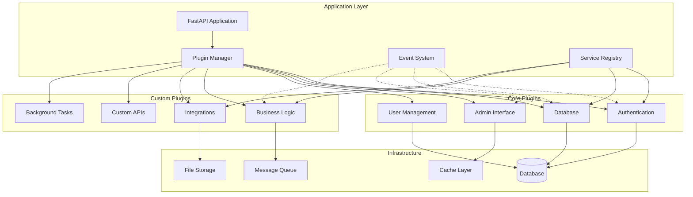
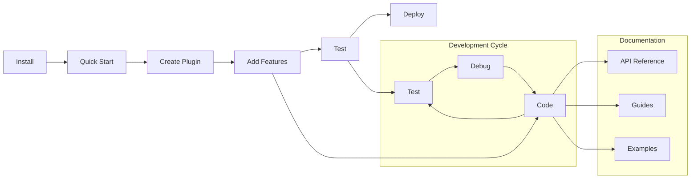

# Welcome to Nexus Platform Documentation

<div class="feature-grid">
    <div class="feature-card">
        <h3>🚀 Plugin-Based Architecture</h3>
        <p>Build modular, scalable applications with our powerful plugin system. Everything is a plugin, from authentication to custom business logic.</p>
    </div>
    <div class="feature-card">
        <h3>⚡ High Performance</h3>
        <p>Built on FastAPI and asyncio for exceptional performance. Handle thousands of concurrent requests with ease.</p>
    </div>
    <div class="feature-card">
        <h3>🔧 Developer Friendly</h3>
        <p>Comprehensive CLI tools, hot reloading, and extensive documentation make development a breeze.</p>
    </div>
    <div class="feature-card">
        <h3>🛡️ Enterprise Ready</h3>
        <p>Built-in authentication, authorization, monitoring, and deployment tools for production environments.</p>
    </div>
</div>

## What is Nexus?

Nexus is the **ultimate plugin-based application platform** that enables developers to build modular, scalable applications with unprecedented ease. Built on FastAPI and designed with enterprise needs in mind, Nexus transforms how you architect and deploy modern applications.

### 🎯 Core Philosophy

Nexus is built on the principle that **everything is a plugin**. This fundamental design decision shapes every aspect of the architecture:

- **Modularity First**: Features are isolated, independent components
- **Event-Driven**: Loose coupling through asynchronous communication
- **Service-Oriented**: Shared functionality through service registry
- **Configuration-Driven**: Behavior controlled through declarative config

## 🏗️ Architecture Overview

Nexus Platform is designed around a **plugin-first architecture** that enables maximum modularity and extensibility:



## 🚀 Quick Start

Get up and running in minutes:

=== "Installation"

    ```bash
    # Install Nexus Platform
    pip install nexus-platform

    # Or install with all optional dependencies
    pip install nexus-platform[full]
    ```

=== "Create Project"

    ```bash
    # Create a new Nexus project
    nexus create my-project
    cd my-project

    # Initialize the project
    nexus init
    ```

=== "Run Development Server"

    ```bash
    # Start the development server
    nexus dev

    # Server will be available at http://localhost:8000
    ```

## 🔧 Core Features

### Plugin System

Everything in Nexus is a plugin, providing:

- **Modularity**: Independent, reusable components
- **Extensibility**: Easy to add new functionality
- **Maintainability**: Clear separation of concerns
- **Testing**: Isolated testing of individual features

### Event-Driven Architecture

Loose coupling through a powerful event system:

- **Asynchronous**: Non-blocking event processing
- **Scalable**: Handle thousands of events per second
- **Flexible**: Custom event types and handlers
- **Reliable**: Built-in error handling and retries

### Service Registry

Shared functionality across plugins:

- **Dependency Injection**: Automatic service resolution
- **Lifecycle Management**: Proper initialization and cleanup
- **Configuration**: Centralized service configuration
- **Health Checks**: Built-in service monitoring

## 📖 Documentation Sections

<div class="plugin-showcase">
    <div class="plugin-card">
        <h4>🏁 Getting Started</h4>
        <p>Installation, quick start, and your first plugin</p>
        <a href="getting-started/">Learn More →</a>
    </div>
    <div class="plugin-card">
        <h4>🏗️ Architecture</h4>
        <p>Core concepts, design patterns, and best practices</p>
        <a href="architecture/">Learn More →</a>
    </div>
    <div class="plugin-card">
        <h4>🔌 Plugin Development</h4>
        <p>Build powerful plugins for your applications</p>
        <a href="plugins/">Learn More →</a>
    </div>
    <div class="plugin-card">
        <h4>📡 API Reference</h4>
        <p>Complete API documentation and examples</p>
        <a href="api/">Learn More →</a>
    </div>
    <div class="plugin-card">
        <h4>🚀 Deployment</h4>
        <p>Production deployment and DevOps guides</p>
        <a href="deployment/">Learn More →</a>
    </div>
    <div class="plugin-card">
        <h4>📚 Guides</h4>
        <p>Step-by-step tutorials and how-to guides</p>
        <a href="guides/">Learn More →</a>
    </div>
</div>

## 🎯 Common Tasks

### I want to...

| Task               | Guide                                             | Time   |
| ------------------ | ------------------------------------------------- | ------ |
| Install Nexus      | [Installation](getting-started/installation.md)   | 2 min  |
| Build first app    | [Quick Start](getting-started/quickstart.md)      | 5 min  |
| Create a plugin    | [First Plugin](getting-started/first-plugin.md)   | 10 min |
| Add database       | [Database Integration](plugins/database.md)       | 15 min |
| Deploy with Docker | [Docker Deployment](deployment/docker.md)         | 20 min |
| Set up monitoring  | [Monitoring](deployment/monitoring.md)            | 30 min |
| Production deploy  | [Kubernetes Deployment](deployment/kubernetes.md) | 45 min |

## 🛠️ Development Workflow



## 🌟 Why Choose Nexus?

### For Developers

- **Rapid Development**: Built-in tools and generators
- **Type Safety**: Full TypeScript-style type hints
- **Testing**: Comprehensive testing utilities
- **Documentation**: Auto-generated API docs

### For Teams

- **Collaboration**: Clear plugin boundaries
- **Scalability**: Horizontal and vertical scaling
- **Maintainability**: Modular architecture
- **Standards**: Built-in best practices

### For Enterprises

- **Security**: Enterprise-grade authentication
- **Monitoring**: Built-in observability
- **Deployment**: Container-ready
- **Support**: Professional support available

## 📊 Learning Path

### Beginner Path

1. [Installation](getting-started/installation.md)
2. [Quick Start](getting-started/quickstart.md)
3. [First Plugin](getting-started/first-plugin.md)
4. [Configuration](getting-started/configuration.md)

### Intermediate Path

1. [Architecture Overview](architecture/overview.md)
2. [Plugin API Routes](plugins/api-routes.md)
3. [Database Integration](plugins/database.md)
4. [Event System](architecture/events.md)

### Advanced Path

1. [Core Components](architecture/core-components.md)
2. [Plugin Testing](plugins/testing.md)
3. [Kubernetes Deployment](deployment/kubernetes.md)
4. [Security Architecture](architecture/security.md)

## 🤝 Community & Support

- **GitHub**: [nexus-platform](https://github.com/dnviti/nexus-platform)
- **Discord**: [Join our community](https://discord.gg/nexus)
- **Documentation**: You're here! 📚
- **Issues**: [Report bugs](https://github.com/dnviti/nexus-platform/issues)

## 📄 License

Nexus Platform is released under the [MIT License](https://github.com/dnviti/nexus-platform/blob/main/LICENSE).

---

<div style="text-align: center; margin-top: 2em;">
    <p><strong>Ready to build something amazing?</strong></p>
    <a href="getting-started/" style="background: #2196f3; color: white; padding: 0.75em 2em; text-decoration: none; border-radius: 0.25em; font-weight: 600;">Get Started Now</a>
</div>
