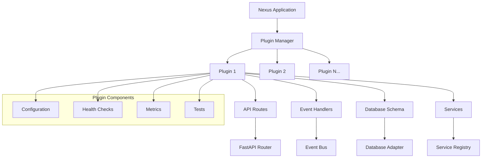

# Plugin Basics

Learn the fundamentals of creating plugins for the Nexus Platform.

## 🎯 Overview

Plugins are the core building blocks of Nexus applications. They provide modular functionality that can be independently developed, tested, and deployed. Every feature in a Nexus application is implemented as a plugin, from authentication to custom business logic.

## 🏗️ Plugin Architecture



## 📦 Plugin Structure

### Basic Plugin Directory

```
plugins/my_plugin/
├── __init__.py          # Plugin package initialization
├── plugin.py            # Main plugin implementation
├── manifest.json        # Plugin metadata and configuration
├── requirements.txt     # Python dependencies (optional)
├── config/             # Plugin configuration files
│   ├── default.yaml
│   ├── production.yaml
│   └── development.yaml
├── tests/              # Plugin tests
│   ├── __init__.py
│   ├── test_plugin.py
│   └── conftest.py
├── schemas/            # Database schemas
│   └── models.py
└── README.md          # Plugin documentation
```

## 📄 Plugin Manifest

The `manifest.json` file defines your plugin's metadata:

```json
{
    "name": "my_awesome_plugin",
    "version": "1.0.0",
    "title": "My Awesome Plugin",
    "description": "An awesome plugin that does amazing things",
    "author": "Your Name",
    "email": "your.email@example.com",
    "license": "MIT",
    "category": "productivity",
    "tags": ["api", "integration", "automation"],
    "python_version": ">=3.11",
    "nexus_version": ">=0.1.0",
    "dependencies": [],
    "permissions": ["database.read", "database.write", "events.publish", "events.subscribe"],
    "configuration": {
        "api_key": {
            "type": "string",
            "required": true,
            "secret": true,
            "description": "API key for external service"
        },
        "max_retries": {
            "type": "integer",
            "default": 3,
            "min": 1,
            "max": 10,
            "description": "Maximum number of retry attempts"
        },
        "enabled": {
            "type": "boolean",
            "default": true,
            "description": "Enable or disable the plugin"
        }
    },
    "api_endpoints": [
        {
            "method": "GET",
            "path": "/status",
            "description": "Get plugin status"
        },
        {
            "method": "POST",
            "path": "/action",
            "description": "Perform plugin action"
        }
    ],
    "events": {
        "publishes": ["my_plugin.action_completed"],
        "subscribes": ["user.created", "system.maintenance"]
    }
}
```

## 🔧 Plugin Class

Create your main plugin class by inheriting from `BasePlugin`:

```python
"""
My Awesome Plugin
A comprehensive example plugin demonstrating Nexus Platform capabilities.
"""

from datetime import datetime
from typing import Any, Dict, List, Optional
from fastapi import APIRouter, HTTPException, status
from pydantic import BaseModel, Field

from nexus.plugins import BasePlugin, HealthStatus
import logging

# Set up logging
logger = logging.getLogger(__name__)


# Pydantic models for API
class ActionRequest(BaseModel):
    """Request model for plugin actions."""
    action: str = Field(..., description="Action to perform")
    parameters: Dict[str, Any] = Field(default_factory=dict)


class ActionResponse(BaseModel):
    """Response model for plugin actions."""
    success: bool
    message: str
    result: Optional[Dict[str, Any]] = None


class MyAwesomePlugin(BasePlugin):
    """
    My Awesome Plugin - demonstrates core plugin functionality.

    Features:
    - HTTP API endpoints
    - Event handling
    - Configuration management
    - Health monitoring
    - Database integration
    """

    def __init__(self):
        """Initialize the plugin."""
        super().__init__()

        # Plugin metadata
        self.name = "my_awesome_plugin"
        self.version = "1.0.0"
        self.description = "An awesome plugin demonstrating Nexus capabilities"
        self.author = "Your Name"
        self.category = "productivity"

        # Plugin state
        self.action_count = 0
        self.last_action = None

    async def initialize(self) -> bool:
        """
        Initialize the plugin.
        Called when the plugin is loaded by the plugin manager.
        """
        try:
            self.logger.info(f"Initializing {self.name} plugin v{self.version}")

            # Load configuration
            await self._load_configuration()

            # Set up external connections
            await self._setup_connections()

            # Subscribe to events
            await self._setup_event_handlers()

            # Register services
            self.register_service(f"{self.name}.api", self)

            self.initialized = True
            self.logger.info(f"{self.name} plugin initialized successfully")

            # Publish initialization event
            await self.publish_event(
                f"{self.name}.initialized",
                {"version": self.version, "timestamp": datetime.utcnow().isoformat()}
            )

            return True

        except Exception as e:
            self.logger.error(f"Failed to initialize {self.name}: {e}", exc_info=True)
            return False

    async def shutdown(self) -> None:
        """
        Clean up plugin resources.
        Called when the plugin is unloaded.
        """
        try:
            self.logger.info(f"Shutting down {self.name} plugin")

            # Save current state
            await self._save_state()

            # Close connections
            await self._cleanup_connections()

            # Publish shutdown event
            await self.publish_event(
                f"{self.name}.shutdown",
                {"action_count": self.action_count}
            )

            self.logger.info(f"{self.name} plugin shut down successfully")

        except Exception as e:
            self.logger.error(f"Error during {self.name} shutdown: {e}", exc_info=True)

    def get_api_routes(self) -> List[APIRouter]:
        """Define HTTP API routes for this plugin."""
        router = APIRouter(tags=[self.name])

        @router.get("/status")
        async def get_status():
            """Get plugin status and statistics."""
            return {
                "plugin": self.name,
                "version": self.version,
                "initialized": self.initialized,
                "action_count": self.action_count,
                "last_action": self.last_action,
                "uptime": self.get_metrics().get("uptime", 0)
            }

        @router.post("/action", response_model=ActionResponse)
        async def perform_action(request: ActionRequest):
            """Perform a custom action."""
            try:
                # Validate plugin is enabled
                if not await self.get_config("enabled", True):
                    raise HTTPException(
                        status_code=status.HTTP_503_SERVICE_UNAVAILABLE,
                        detail="Plugin is disabled"
                    )

                # Execute the action
                result = await self._execute_action(request.action, request.parameters)

                # Update statistics
                self.action_count += 1
                self.last_action = {
                    "action": request.action,
                    "timestamp": datetime.utcnow().isoformat()
                }

                # Publish action event
                await self.publish_event(
                    f"{self.name}.action_completed",
                    {
                        "action": request.action,
                        "parameters": request.parameters,
                        "result": result
                    }
                )

                return ActionResponse(
                    success=True,
                    message=f"Action '{request.action}' completed successfully",
                    result=result
                )

            except Exception as e:
                self.logger.error(f"Action failed: {e}", exc_info=True)
                return ActionResponse(
                    success=False,
                    message=f"Action failed: {str(e)}"
                )

        @router.get("/health")
        async def health_check():
            """Plugin health check endpoint."""
            health_status = await self.health_check()
            return health_status.dict()

        return [router]

    def get_database_schema(self) -> Dict[str, Any]:
        """Define database schema for this plugin."""
        return {
            "collections": {
                "plugin_actions": {
                    "indexes": [
                        {"field": "id", "unique": True},
                        {"field": "action"},
                        {"field": "timestamp"}
                    ]
                }
            },
            "initial_data": {
                "config": {
                    "enabled": True,
                    "max_actions_per_minute": 60,
                    "log_actions": True
                }
            }
        }

    async def health_check(self) -> HealthStatus:
        """Check plugin health status."""
        health = await super().health_check()

        try:
            # Add custom health checks
            health.components["actions"] = {
                "status": "healthy",
                "count": self.action_count
            }

            # Check configuration
            enabled = await self.get_config("enabled", True)
            health.components["configuration"] = {
                "status": "healthy" if enabled else "disabled"
            }

        except Exception as e:
            health.components["checks"] = {
                "status": "unhealthy",
                "error": str(e)
            }
            health.healthy = False

        # Update metrics
        health.metrics.update({
            "actions_total": float(self.action_count)
        })

        return health

    # Private methods

    async def _load_configuration(self) -> None:
        """Load plugin configuration."""
        self.config = {
            "enabled": await self.get_config("enabled", True),
            "api_key": await self.get_config("api_key"),
            "max_retries": await self.get_config("max_retries", 3),
            "timeout": await self.get_config("timeout", 30)
        }

        # Validate required configuration
        if not self.config["api_key"]:
            raise ValueError("API key is required but not configured")

        self.logger.debug(f"Configuration loaded: {len(self.config)} settings")

    async def _setup_connections(self) -> None:
        """Set up external connections."""
        # Initialize external service connections
        # Example: HTTP client, database connections, etc.
        self.logger.debug("External connections established")

    async def _cleanup_connections(self) -> None:
        """Clean up external connections."""
        # Close external connections
        self.logger.debug("External connections closed")

    async def _setup_event_handlers(self) -> None:
        """Set up event subscriptions."""
        # Subscribe to relevant events
        await self.subscribe_to_event("user.created", self._handle_user_created)
        await self.subscribe_to_event("system.maintenance", self._handle_maintenance)

    async def _handle_user_created(self, event):
        """Handle user creation events."""
        user_id = event.data.get("user_id")
        username = event.data.get("username", "Unknown")

        self.logger.info(f"New user created: {username} (ID: {user_id})")

        # Perform any user-specific setup
        # Example: create user-specific resources, send welcome message, etc.

    async def _handle_maintenance(self, event):
        """Handle system maintenance events."""
        self.logger.info("System maintenance event received")

        # Prepare for maintenance
        await self._save_state()

    async def _execute_action(self, action: str, parameters: Dict[str, Any]) -> Dict[str, Any]:
        """Execute a specific action."""
        if action == "ping":
            return {"message": "pong", "timestamp": datetime.utcnow().isoformat()}

        elif action == "echo":
            return {"echo": parameters.get("message", "Hello, World!")}

        elif action == "count":
            return {"current_count": self.action_count}

        else:
            raise ValueError(f"Unknown action: {action}")

    async def _save_state(self) -> None:
        """Save plugin state."""
        await self.set_config("action_count", self.action_count)
        await self.set_data("last_action", self.last_action)


# Plugin factory function
def create_plugin():
    """Create and return the plugin instance."""
    return MyAwesomePlugin()
```

## 🧪 Testing Your Plugin

Create comprehensive tests for your plugin:

```python
# tests/test_plugin.py
import pytest
import asyncio
from unittest.mock import AsyncMock, MagicMock

from plugins.my_awesome_plugin.plugin import MyAwesomePlugin


class TestMyAwesomePlugin:
    """Test cases for MyAwesome Plugin."""

    async def setup_method(self):
        """Set up test fixtures."""
        self.plugin = MyAwesomePlugin()

        # Mock dependencies
        self.plugin.logger = MagicMock()
        self.plugin.get_config = AsyncMock()
        self.plugin.set_config = AsyncMock()
        self.plugin.publish_event = AsyncMock()

    async def teardown_method(self):
        """Clean up after tests."""
        if hasattr(self.plugin, 'cleanup'):
            await self.plugin.shutdown()

    async def test_plugin_initialization(self):
        """Test plugin initializes correctly."""
        # Setup mocks
        self.plugin.get_config.return_value = "test-api-key"

        # Test initialization
        result = await self.plugin.initialize()

        assert result is True
        assert self.plugin.initialized is True
        assert self.plugin.name == "my_awesome_plugin"

    async def test_plugin_disabled(self):
        """Test plugin behavior when disabled."""
        self.plugin.get_config.return_value = False  # disabled

        # Plugin should still initialize but be disabled
        result = await self.plugin.initialize()
        assert result is True

    async def test_action_execution(self):
        """Test action execution."""
        await self.plugin.initialize()

        # Test ping action
        result = await self.plugin._execute_action("ping", {})
        assert result["message"] == "pong"

        # Test echo action
        result = await self.plugin._execute_action("echo", {"message": "test"})
        assert result["echo"] == "test"

        # Test invalid action
        with pytest.raises(ValueError):
            await self.plugin._execute_action("invalid", {})

    async def test_health_check(self):
        """Test plugin health check."""
        await self.plugin.initialize()

        health = await self.plugin.health_check()
        assert health.healthy is True
        assert "actions" in health.components

    async def test_event_handlers(self):
        """Test event handling."""
        await self.plugin.initialize()

        # Test user created event
        event = MagicMock()
        event.data = {"user_id": "123", "username": "testuser"}

        await self.plugin._handle_user_created(event)

        # Verify event was processed (check logs, state changes, etc.)
        self.plugin.logger.info.assert_called()


class TestPluginIntegration:
    """Integration tests for plugin."""

    async def test_full_workflow(self):
        """Test complete plugin workflow."""
        plugin = MyAwesomePlugin()

        # Initialize plugin
        assert await plugin.initialize() is True

        # Perform action
        result = await plugin._execute_action("count", {})
        assert "current_count" in result

        # Check health
        health = await plugin.health_check()
        assert health.healthy is True

        # Shutdown
        await plugin.shutdown()
```

## 🚀 Plugin Lifecycle

Understanding the plugin lifecycle is crucial for proper resource management:

### 1. Discovery

- Nexus scans the plugins directory
- Validates `manifest.json` files
- Checks dependencies and permissions

### 2. Loading

- Plugin module is imported
- Plugin class is instantiated
- Dependencies are resolved

### 3. Initialization

- `initialize()` method is called
- Resources are set up
- Event handlers are registered
- API routes are mounted

### 4. Runtime

- Plugin handles events
- Serves HTTP requests
- Performs background tasks
- Manages its state

### 5. Shutdown

- `shutdown()` method is called
- Resources are cleaned up
- Connections are closed
- State is saved

## 🎯 Best Practices

### 1. Error Handling

```python
async def robust_operation(self):
    """Example of robust error handling."""
    try:
        # Risky operation
        result = await self.external_api_call()
        return result
    except ConnectionError as e:
        self.logger.warning(f"Connection failed, retrying: {e}")
        # Implement retry logic
        raise
    except Exception as e:
        self.logger.error(f"Unexpected error: {e}", exc_info=True)
        raise
```

### 2. Configuration Validation

```python
async def _validate_config(self) -> None:
    """Validate plugin configuration."""
    api_key = await self.get_config("api_key")
    if not api_key:
        raise ValueError("API key is required")

    timeout = await self.get_config("timeout", 30)
    if timeout <= 0:
        raise ValueError("Timeout must be positive")

    max_retries = await self.get_config("max_retries", 3)
    if not 1 <= max_retries <= 10:
        raise ValueError("Max retries must be between 1 and 10")
```

### 3. Resource Management

```python
class ResourceAwarePlugin(BasePlugin):
    """Plugin with proper resource management."""

    def __init__(self):
        super().__init__()
        self.connections = []
        self.background_tasks = []

    async def initialize(self) -> bool:
        """Initialize with resource tracking."""
        try:
            # Set up resources
            connection = await self.create_connection()
            self.connections.append(connection)

            # Start background tasks
            task = asyncio.create_task(self.background_worker())
            self.background_tasks.append(task)

            return True
        except Exception as e:
            # Clean up partial initialization
            await self.cleanup()
            raise

    async def shutdown(self) -> None:
        """Clean up all resources."""
        # Cancel background tasks
        for task in self.background_tasks:
            task.cancel()
            try:
                await task
            except asyncio.CancelledError:
                pass

        # Close connections
        for connection in self.connections:
            await connection.close()

        self.connections.clear()
        self.background_tasks.clear()
```

### 4. Async Best Practices

```python
# Good: Use async/await properly
async def process_items(self, items):
    return [await self.process_item(item) for item in items]

# Better: Use asyncio.gather for concurrent processing
async def process_items_concurrent(self, items):
    tasks = [self.process_item(item) for item in items]
    return await asyncio.gather(*tasks)

# Best: Use semaphore to limit concurrency
async def process_items_limited(self, items):
    semaphore = asyncio.Semaphore(5)  # Limit to 5 concurrent operations

    async def limited_process(item):
        async with semaphore:
            return await self.process_item(item)

    tasks = [limited_process(item) for item in items]
    return await asyncio.gather(*tasks)
```

## 🎯 Next Steps

Now that you understand plugin basics:

1. **[API Routes](api-routes.md)** - Create HTTP endpoints
2. **[Database Integration](database.md)** - Work with data persistence
3. **[Event System](events.md)** - Handle and emit events
4. **[Plugin Testing](testing.md)** - Test your plugins thoroughly
5. **[Advanced Patterns](advanced.md)** - Complex plugin architectures

---

**Ready to build something amazing?** Start with our [First Plugin](../getting-started/first-plugin.md) tutorial!
