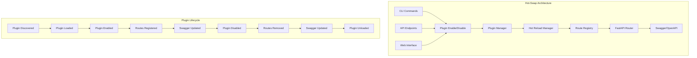

# Hot-Swappable Plugin System

Enable and disable plugins at runtime without restarting your Nexus application.

## 🔥 Overview

The hot-swappable plugin system allows you to:

- **Enable/disable plugins at runtime** without application restart
- **Dynamically register/remove API routes** in real-time
- **Update Swagger documentation** automatically when plugins change
- **Persist plugin state** across application restarts
- **Manage plugins via CLI, API, or web interface**



## 🚀 Quick Start

### Enable a Plugin at Runtime

```bash
# Using CLI
nexus plugin enable my_plugin

# Using admin CLI
nexus-admin plugin enable my_plugin

# Using API
curl -X POST http://localhost:8000/api/plugins/my_plugin/enable
```

### Disable a Plugin at Runtime

```bash
# Using CLI
nexus plugin disable my_plugin

# Using admin CLI
nexus-admin plugin disable my_plugin

# Using API
curl -X POST http://localhost:8000/api/plugins/my_plugin/disable
```

## 🛠️ CLI Commands

### Basic Plugin Management

```bash
# List all plugins with status
nexus plugin list

# Get detailed plugin information
nexus plugin info my_plugin

# Enable a plugin
nexus plugin enable my_plugin

# Disable a plugin
nexus plugin disable my_plugin

# Reload a plugin (disable + enable)
nexus-admin plugin restart my_plugin
```

### Advanced Options

```bash
# Enable plugin without registering routes
nexus plugin enable my_plugin --no-routes

# Disable plugin without removing routes
nexus plugin disable my_plugin --no-routes

# Force disable (skip graceful shutdown)
nexus-admin plugin disable my_plugin --force

# Enable on all instances (cluster mode)
nexus-admin plugin enable my_plugin --all-instances
```

## 🌐 API Endpoints

### Plugin Management

| Method | Endpoint | Description |
|--------|----------|-------------|
| `GET` | `/api/plugins` | List all plugins with status |
| `POST` | `/api/plugins/{name}/enable` | Enable a plugin |
| `POST` | `/api/plugins/{name}/disable` | Disable a plugin |
| `POST` | `/api/plugins/{name}/reload` | Reload a plugin |
| `GET` | `/api/plugins/{name}/info` | Get plugin details |
| `POST` | `/api/plugins/discover` | Discover new plugins |

### System Status

| Method | Endpoint | Description |
|--------|----------|-------------|
| `GET` | `/api/plugins/status/summary` | Plugin system summary |
| `GET` | `/api/hot-reload/status` | Hot reload system status |
| `GET` | `/api/hot-reload/plugins/{name}/info` | Plugin hot reload info |

### Example API Usage

```python
import httpx

async def manage_plugin():
    async with httpx.AsyncClient() as client:
        # Enable plugin
        response = await client.post(
            "http://localhost:8000/api/plugins/my_plugin/enable"
        )
        print(response.json())
        # {"message": "Plugin my_plugin enabled successfully", "routes_affected": 5}

        # Check plugin info
        response = await client.get(
            "http://localhost:8000/api/plugins/my_plugin/info"
        )
        info = response.json()
        print(f"Plugin has {info['routes']['count']} active routes")

        # Disable plugin
        response = await client.post(
            "http://localhost:8000/api/plugins/my_plugin/disable"
        )
        print(response.json())
```

## 🔧 Integration Examples

### Python Integration

```python
from nexus import create_nexus_app

app = create_nexus_app(title="My App")

@app.on_startup
async def setup():
    # Enable plugins programmatically
    await app.plugin_manager.enable_plugin("analytics")
    await app.plugin_manager.enable_plugin("notifications")

    # Check which plugins are active
    active = app.hot_reload_manager.get_active_plugins()
    print(f"Active plugins: {active}")

# Enable plugin with custom logic
async def enable_with_validation(plugin_name: str):
    # Custom validation
    plugin_info = app.plugin_manager.get_plugin_info(plugin_name)
    if not plugin_info:
        raise ValueError(f"Plugin {plugin_name} not found")

    # Enable the plugin
    success = await app.plugin_manager.enable_plugin(plugin_name)

    if success:
        # Custom post-enable logic
        print(f"Plugin {plugin_name} enabled successfully")

        # Check routes
        route_count = app.hot_reload_manager.get_plugin_route_count(plugin_name)
        print(f"Registered {route_count} routes")

    return success
```

### Web Interface Integration

```javascript
// Frontend JavaScript example
class PluginManager {
    constructor(baseUrl = 'http://localhost:8000') {
        this.baseUrl = baseUrl;
    }

    async listPlugins() {
        const response = await fetch(`${this.baseUrl}/api/plugins`);
        return await response.json();
    }

    async enablePlugin(name) {
        const response = await fetch(
            `${this.baseUrl}/api/plugins/${name}/enable`,
            { method: 'POST' }
        );
        return await response.json();
    }

    async disablePlugin(name) {
        const response = await fetch(
            `${this.baseUrl}/api/plugins/${name}/disable`,
            { method: 'POST' }
        );
        return await response.json();
    }

    async getPluginInfo(name) {
        const response = await fetch(`${this.baseUrl}/api/plugins/${name}/info`);
        return await response.json();
    }
}

// Usage
const pluginManager = new PluginManager();

// Enable plugin and update UI
async function togglePlugin(name, enable) {
    try {
        const result = enable
            ? await pluginManager.enablePlugin(name)
            : await pluginManager.disablePlugin(name);

        console.log(result.message);

        // Update UI to show new routes
        if (result.routes_affected > 0) {
            updateSwaggerDocs();
        }
    } catch (error) {
        console.error('Plugin toggle failed:', error);
    }
}
```

## 📊 Monitoring and Debugging

### Plugin Status Monitoring

```python
async def monitor_plugins(app):
    """Monitor plugin status and health."""
    while True:
        # Get plugin summary
        plugins = app.plugin_manager._plugin_info
        enabled_count = 0
        total_routes = 0

        for plugin_id in plugins:
            status = app.plugin_manager.get_plugin_status(plugin_id)
            if status == PluginStatus.ENABLED:
                enabled_count += 1

                # Count routes
                if app.hot_reload_manager.is_plugin_active(plugin_id):
                    total_routes += app.hot_reload_manager.get_plugin_route_count(plugin_id)

        print(f"Plugins: {enabled_count}/{len(plugins)} enabled, {total_routes} routes active")

        # Wait before next check
        await asyncio.sleep(30)
```

### Hot Reload Status

```bash
# Check hot reload system status
curl http://localhost:8000/api/hot-reload/status

# Response:
# {
#   "active_plugins": ["user_management", "analytics"],
#   "total_active": 2,
#   "status": "operational"
# }
```

### Plugin Route Details

```bash
# Get plugin-specific route information
curl http://localhost:8000/api/plugins/user_management/info

# Response includes route details:
# {
#   "routes": {
#     "count": 8,
#     "details": [
#       {
#         "path": "/users",
#         "methods": ["GET", "POST"],
#         "name": "list_users",
#         "summary": "List all users"
#       }
#     ]
#   }
# }
```

## 🔒 Security Considerations

### Permission-Based Plugin Management

```python
from nexus.plugins import requires_permission

class AdminPlugin(BasePlugin):
    @requires_permission("admin.plugins.enable")
    async def enable_plugin_endpoint(self, plugin_name: str):
        # Only users with admin.plugins.enable permission can access
        return await self.plugin_manager.enable_plugin(plugin_name)
```

### Safe Plugin Loading

```python
async def safe_plugin_enable(plugin_name: str, validate_dependencies: bool = True):
    """Safely enable a plugin with validation."""
    try:
        # Validate plugin exists
        plugin_info = app.plugin_manager.get_plugin_info(plugin_name)
        if not plugin_info:
            raise ValueError(f"Plugin {plugin_name} not found")

        # Check dependencies if requested
        if validate_dependencies:
            for dep, version in plugin_info.dependencies.items():
                # Validate dependency availability
                if not check_dependency(dep, version):
                    raise ValueError(f"Missing dependency: {dep} {version}")

        # Enable with timeout
        success = await asyncio.wait_for(
            app.plugin_manager.enable_plugin(plugin_name),
            timeout=30.0
        )

        return success

    except asyncio.TimeoutError:
        logger.error(f"Plugin {plugin_name} enable timed out")
        return False
    except Exception as e:
        logger.error(f"Failed to enable plugin {plugin_name}: {e}")
        return False
```

## 🧪 Testing Plugin Hot-Swap

### Automated Testing

```python
import pytest
from nexus import create_nexus_app
from nexus.testing import PluginTestCase

class TestPluginHotSwap(PluginTestCase):
    async def test_enable_disable_cycle(self):
        """Test enabling and disabling a plugin."""
        app = self.create_test_app()

        # Start with plugin disabled
        assert not app.plugin_manager.get_plugin_status("test_plugin")

        # Enable plugin
        success = await app.plugin_manager.enable_plugin("test_plugin")
        assert success

        # Check routes are registered
        route_count = app.hot_reload_manager.get_plugin_route_count("test_plugin")
        assert route_count > 0

        # Disable plugin
        success = await app.plugin_manager.disable_plugin("test_plugin")
        assert success

        # Check routes are removed
        assert not app.hot_reload_manager.is_plugin_active("test_plugin")

    async def test_swagger_updates(self):
        """Test that Swagger documentation updates."""
        app = self.create_test_app()
        client = self.create_test_client(app)

        # Get initial OpenAPI spec
        response = await client.get("/openapi.json")
        initial_spec = response.json()
        initial_paths = set(initial_spec["paths"].keys())

        # Enable plugin
        await app.plugin_manager.enable_plugin("test_plugin")

        # Get updated OpenAPI spec
        response = await client.get("/openapi.json")
        updated_spec = response.json()
        updated_paths = set(updated_spec["paths"].keys())

        # Should have new paths
        assert len(updated_paths) > len(initial_paths)

        # Disable plugin
        await app.plugin_manager.disable_plugin("test_plugin")

        # Get final OpenAPI spec
        response = await client.get("/openapi.json")
        final_spec = response.json()
        final_paths = set(final_spec["paths"].keys())

        # Should be back to initial state
        assert final_paths == initial_paths
```

### Manual Testing Script

Run the provided test script to verify functionality:

```bash
# Make sure your app is running
python main.py &

# Run the hot-swap test
python test_plugin_hotswap.py
```

## 🚨 Troubleshooting

### Common Issues

**Plugin won't enable:**
```bash
# Check plugin exists
nexus plugin list | grep my_plugin

# Check for errors
nexus-admin system logs --filter plugin --lines 50
```

**Routes not appearing in Swagger:**
```bash
# Check hot reload status
curl http://localhost:8000/api/hot-reload/status

# Force refresh OpenAPI schema
curl http://localhost:8000/openapi.json
```

**Plugin state not persisting:**
```bash
# Check database connection
nexus-admin database status

# Validate plugin state
curl http://localhost:8000/api/plugins/my_plugin/info
```

### Debug Mode

Enable debug logging for detailed hot-swap information:

```python
import logging
logging.getLogger("nexus.hot_reload").setLevel(logging.DEBUG)
logging.getLogger("nexus.core.plugin_manager").setLevel(logging.DEBUG)
```

### Performance Monitoring

```python
import time

async def benchmark_plugin_toggle(plugin_name: str, iterations: int = 10):
    """Benchmark plugin enable/disable performance."""
    enable_times = []
    disable_times = []

    for i in range(iterations):
        # Benchmark enable
        start = time.time()
        await app.plugin_manager.enable_plugin(plugin_name)
        enable_times.append(time.time() - start)

        # Benchmark disable
        start = time.time()
        await app.plugin_manager.disable_plugin(plugin_name)
        disable_times.append(time.time() - start)

    print(f"Enable average: {sum(enable_times)/len(enable_times):.3f}s")
    print(f"Disable average: {sum(disable_times)/len(disable_times):.3f}s")
```

## 🎯 Best Practices

### 1. Plugin Design for Hot-Swap

```python
class HotSwapFriendlyPlugin(BasePlugin):
    def __init__(self):
        super().__init__()
        self._cleanup_tasks = []
        self._background_tasks = set()

    async def initialize(self):
        """Clean initialization that can be repeated."""
        # Store cleanup references
        task = asyncio.create_task(self._background_worker())
        self._background_tasks.add(task)
        task.add_done_callback(self._background_tasks.discard)

        return True

    async def shutdown(self):
        """Proper cleanup for hot-swap."""
        # Cancel background tasks
        for task in self._background_tasks:
            task.cancel()

        # Wait for tasks to complete
        if self._background_tasks:
            await asyncio.gather(*self._background_tasks, return_exceptions=True)

        # Custom cleanup
        for cleanup_func in self._cleanup_tasks:
            try:
                await cleanup_func()
            except Exception as e:
                self.logger.error(f"Cleanup error: {e}")
```

### 2. Graceful State Management

```python
async def enable_plugin_gracefully(plugin_name: str):
    """Enable plugin with proper state validation."""
    # Check current state
    current_status = app.plugin_manager.get_plugin_status(plugin_name)

    if current_status == PluginStatus.ENABLED:
        logger.info(f"Plugin {plugin_name} already enabled")
        return True

    # Check for conflicts
    conflicts = check_plugin_conflicts(plugin_name)
    if conflicts:
        logger.warning(f"Plugin conflicts detected: {conflicts}")
        return False

    # Enable with monitoring
    success = await app.plugin_manager.enable_plugin(plugin_name)

    if success:
        # Verify routes are working
        await verify_plugin_routes(plugin_name)
        logger.info(f"Plugin {plugin_name} enabled and verified")

    return success
```

### 3. Production Deployment

```python
# Use feature flags for safe rollouts
async def controlled_plugin_rollout(plugin_name: str, percentage: float = 0.1):
    """Enable plugin for a percentage of requests."""
    import random

    # Enable plugin
    await app.plugin_manager.enable_plugin(plugin_name)

    # Add middleware to route only some traffic
    @app.middleware("http")
    async def plugin_routing_middleware(request, call_next):
        if request.url.path.startswith(f"/api/plugins/{plugin_name}/"):
            if random.random() > percentage:
                # Route to fallback
                return JSONResponse({"error": "Feature not available"}, 503)

        return await call_next(request)
```

---

The hot-swappable plugin system makes Nexus applications incredibly flexible and maintainable. You can now update functionality without downtime and provide dynamic feature management for your users.

**Next Steps:**
- [Plugin Testing](testing.md) - Test your hot-swappable plugins
- [Advanced Features](advanced.md) - Complex plugin patterns
- [Production Deployment](../deployment/README.md) - Deploy with hot-swap
