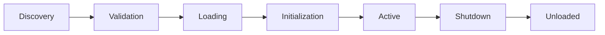

# Nexus Framework Plugin Development Guide

## Table of Contents

1. [Introduction](#introduction)
2. [Plugin Anatomy](#plugin-anatomy)
3. [Creating Your First Plugin](#creating-your-first-plugin)
4. [Plugin Lifecycle](#plugin-lifecycle)
5. [Plugin Categories](#plugin-categories)
6. [Advanced Features](#advanced-features)
7. [Testing Plugins](#testing-plugins)
8. [Plugin Distribution](#plugin-distribution)
9. [Best Practices](#best-practices)
10. [Common Patterns](#common-patterns)
11. [Troubleshooting](#troubleshooting)

## Introduction

Plugins are the heart of Nexus Framework applications. Every piece of business functionality is delivered through plugins, making your application infinitely extensible and maintainable.

### What is a Plugin?

A plugin is a self-contained module that:

- **Encapsulates** a specific domain or functionality
- **Provides** API endpoints, services, and UI components
- **Integrates** seamlessly with the core framework
- **Communicates** with other plugins through events
- **Manages** its own data and configuration

### Plugin Benefits

- **🎯 Focused Development**: Work on one domain at a time
- **♻️ Reusability**: Share plugins across projects
- **🔧 Maintainability**: Update features independently
- **🚀 Scalability**: Deploy plugins as microservices
- **👥 Team Collaboration**: Teams can work on different plugins

## Plugin Anatomy

### Directory Structure

```
my-plugin/
├── __init__.py              # Plugin exports
├── plugin.py                # Main plugin class
├── manifest.json            # Plugin metadata
├── pyproject.toml          # Python dependencies and project config
├── README.md               # Documentation
├── LICENSE                 # License file
├── config/                 # Configuration
│   ├── default.yaml       # Default settings
│   └── schema.json        # Configuration schema
├── models/                 # Domain models
│   ├── __init__.py
│   ├── entities.py        # Business entities
│   ├── schemas.py         # Pydantic schemas
│   └── enums.py          # Enumerations
├── services/               # Business logic
│   ├── __init__.py
│   ├── domain_service.py  # Domain services
│   ├── app_service.py     # Application services
│   └── validators.py      # Validation logic
├── repositories/           # Data access
│   ├── __init__.py
│   └── repository.py      # Repository implementations
├── api/                    # API layer
│   ├── __init__.py
│   ├── routes.py          # FastAPI routes
│   ├── dependencies.py    # Route dependencies
│   └── middleware.py      # Plugin middleware
├── events/                 # Event handling
│   ├── __init__.py
│   ├── publishers.py      # Event publishers
│   ├── subscribers.py     # Event handlers
│   └── schemas.py         # Event schemas
├── tasks/                  # Background tasks
│   ├── __init__.py
│   └── workers.py         # Async workers
├── ui/                     # User interface
│   ├── templates/         # HTML templates
│   ├── static/           # CSS, JS, images
│   └── components.py      # UI components
├── migrations/             # Database migrations
│   └── 001_initial.py     # Migration scripts
├── tests/                  # Test suite
│   ├── unit/             # Unit tests
│   ├── integration/      # Integration tests
│   └── fixtures/         # Test fixtures
└── docs/                   # Documentation
    ├── api.md            # API documentation
    └── user_guide.md     # User guide
```

### Core Files

#### 1. Plugin Class (`plugin.py`)

```python
from nexus.plugins import BasePlugin, PluginInfo
from nexus.plugins.categories import BusinessPlugin
from fastapi import APIRouter, Depends
from typing import Dict, List, Any, Optional
import logging

class MyAwesomePlugin(BasePlugin, BusinessPlugin):
    """A comprehensive business plugin example."""

    def __init__(self):
        """Initialize the plugin."""
        super().__init__()

        # Plugin metadata
        self.info = PluginInfo(
            name="my_awesome_plugin",
            display_name="My Awesome Plugin",
            version="1.0.0",
            description="An example business plugin",
            author="Your Name",
            category="business"
        )

        # Initialize services
        self.service = None
        self.repository = None

        # Setup logging
        self.logger = logging.getLogger(f"nexus.plugins.{self.info.name}")

    async def initialize(self) -> bool:
        """Initialize plugin resources."""
        try:
            self.logger.info(f"Initializing {self.info.display_name}")

            # Initialize database connection
            from .repositories import MyRepository
            self.repository = MyRepository(self.db_adapter)

            # Initialize services
            from .services import MyDomainService
            self.service = MyDomainService(self.repository)

            # Register event handlers
            await self._register_event_handlers()

            # Perform health check
            if not await self._verify_dependencies():
                return False

            self.logger.info(f"{self.info.display_name} initialized successfully")
            return True

        except Exception as e:
            self.logger.error(f"Failed to initialize: {e}")
            return False

    async def shutdown(self) -> None:
        """Cleanup plugin resources."""
        self.logger.info(f"Shutting down {self.info.display_name}")

        # Cleanup resources
        if self.repository:
            await self.repository.close()

        # Unregister event handlers
        await self._unregister_event_handlers()

        self.logger.info(f"{self.info.display_name} shut down successfully")

    def get_api_routes(self) -> List[APIRouter]:
        """Return plugin API routes."""
        from .api.routes import router
        return [router]

    def get_database_schema(self) -> Dict[str, Any]:
        """Return database schema."""
        return {
            "collections": {
                "items": {
                    "indexes": [
                        {"field": "name", "unique": True},
                        {"field": "created_at"}
                    ]
                },
                "categories": {
                    "indexes": [
                        {"field": "slug", "unique": True}
                    ]
                }
            },
            "initial_data": {
                "categories": [
                    {"id": "1", "name": "Default", "slug": "default"}
                ]
            }
        }

    async def _register_event_handlers(self):
        """Register event subscriptions."""
        from .events.subscribers import handle_user_created

        await self.event_bus.subscribe(
            "user.created",
            handle_user_created
        )

    async def _verify_dependencies(self) -> bool:
        """Verify plugin dependencies are available."""
        # Check for required services
        required_services = ["auth_service", "email_service"]

        for service_name in required_services:
            if not self.service_registry.has_service(service_name):
                self.logger.error(f"Required service '{service_name}' not found")
                return False

        return True
```

#### 2. Manifest File (`manifest.json`)

```json
{
  "name": "my_awesome_plugin",
  "display_name": "My Awesome Plugin",
  "category": "business",
  "version": "1.0.0",
  "description": "A comprehensive business plugin for Nexus Framework",
  "author": {
    "name": "Your Name",
    "email": "you@example.com",
    "url": "https://yourwebsite.com"
  },
  "license": "MIT",
  "homepage": "https://github.com/yourusername/my-awesome-plugin",
  "repository": {
    "type": "git",
    "url": "https://github.com/yourusername/my-awesome-plugin.git"
  },
  "documentation": "https://docs.example.com/my-awesome-plugin",
  "keywords": ["business", "example", "awesome"],
  "icon": "icon.png",
  "screenshots": ["screenshots/dashboard.png", "screenshots/settings.png"],
  "dependencies": {
    "nexus": ">=1.0.0",
    "python": ">=3.11",
    "packages": ["pydantic>=2.0.0", "httpx>=0.24.0", "redis>=4.5.0"],
    "plugins": ["auth_plugin>=1.0.0", "email_plugin>=1.0.0"],
    "system": ["redis-server>=6.0"]
  },
  "permissions": [
    "database.read",
    "database.write",
    "events.publish",
    "events.subscribe",
    "api.register",
    "ui.register"
  ],
  "configuration": {
    "schema": "config/schema.json",
    "defaults": "config/default.yaml",
    "required": ["api_key", "database_name"],
    "optional": ["cache_ttl", "max_retries", "timeout"]
  },
  "api": {
    "prefix": "/api/awesome",
    "version": "v1",
    "rate_limit": {
      "requests": 100,
      "period": 60
    }
  },
  "ui": {
    "enabled": true,
    "menu": {
      "title": "My Awesome Plugin",
      "icon": "fas fa-rocket",
      "position": 10,
      "parent": null
    },
    "dashboard_widgets": [
      {
        "id": "awesome_stats",
        "title": "Statistics",
        "size": "medium",
        "position": 1
      }
    ]
  },
  "features": {
    "hot_reload": true,
    "background_tasks": true,
    "websocket": true,
    "graphql": false
  },
  "compatibility": {
    "min_nexus_version": "1.0.0",
    "max_nexus_version": "2.0.0",
    "platforms": ["linux", "darwin", "win32"]
  },
  "health_check": {
    "endpoint": "/health",
    "interval": 30,
    "timeout": 5
  }
}
```

#### 3. API Routes (`api/routes.py`)

```python
from fastapi import APIRouter, Depends, HTTPException, status, Query
from typing import List, Optional
from ..models.schemas import (
    ItemCreate, ItemUpdate, ItemResponse,
    PaginatedResponse, ErrorResponse
)
from ..services import ItemService
from nexus.auth import require_auth, get_current_user
from nexus.core import get_db

router = APIRouter(tags=["My Awesome Plugin"])

# Dependency injection
async def get_item_service(db = Depends(get_db)) -> ItemService:
    """Get item service instance."""
    return ItemService(db)

@router.get("/items", response_model=PaginatedResponse[ItemResponse])
async def list_items(
    page: int = Query(1, ge=1),
    limit: int = Query(10, ge=1, le=100),
    search: Optional[str] = None,
    service: ItemService = Depends(get_item_service),
    current_user = Depends(get_current_user)
):
    """List all items with pagination."""
    items = await service.list_items(
        page=page,
        limit=limit,
        search=search,
        user_id=current_user.id
    )
    return items

@router.post("/items", response_model=ItemResponse, status_code=status.HTTP_201_CREATED)
async def create_item(
    item_data: ItemCreate,
    service: ItemService = Depends(get_item_service),
    current_user = Depends(require_auth)
):
    """Create a new item."""
    try:
        item = await service.create_item(
            data=item_data,
            user_id=current_user.id
        )
        return item
    except ValueError as e:
        raise HTTPException(
            status_code=status.HTTP_400_BAD_REQUEST,
            detail=str(e)
        )

@router.get("/items/{item_id}", response_model=ItemResponse)
async def get_item(
    item_id: str,
    service: ItemService = Depends(get_item_service),
    current_user = Depends(get_current_user)
):
    """Get a specific item."""
    item = await service.get_item(item_id, user_id=current_user.id)
    if not item:
        raise HTTPException(
            status_code=status.HTTP_404_NOT_FOUND,
            detail="Item not found"
        )
    return item

@router.put("/items/{item_id}", response_model=ItemResponse)
async def update_item(
    item_id: str,
    item_data: ItemUpdate,
    service: ItemService = Depends(get_item_service),
    current_user = Depends(require_auth)
):
    """Update an item."""
    item = await service.update_item(
        item_id=item_id,
        data=item_data,
        user_id=current_user.id
    )
    if not item:
        raise HTTPException(
            status_code=status.HTTP_404_NOT_FOUND,
            detail="Item not found"
        )
    return item

@router.delete("/items/{item_id}", status_code=status.HTTP_204_NO_CONTENT)
async def delete_item(
    item_id: str,
    service: ItemService = Depends(get_item_service),
    current_user = Depends(require_auth)
):
    """Delete an item."""
    success = await service.delete_item(item_id, user_id=current_user.id)
    if not success:
        raise HTTPException(
            status_code=status.HTTP_404_NOT_FOUND,
            detail="Item not found"
        )

# WebSocket endpoint
@router.websocket("/ws")
async def websocket_endpoint(websocket: WebSocket):
    """WebSocket connection for real-time updates."""
    await websocket.accept()
    try:
        while True:
            data = await websocket.receive_text()
            # Process websocket data
            await websocket.send_text(f"Echo: {data}")
    except WebSocketDisconnect:
        pass
```

## Creating Your First Plugin

### Step 1: Set Up Development Environment

```bash
# Create plugin directory
mkdir my-first-plugin
cd my-first-plugin

# Create virtual environment
python -m venv venv
source venv/bin/activate  # On Windows: venv\Scripts\activate

# Install Nexus SDK
pip install nexus-sdk

# Initialize plugin structure
nexus plugin init

# Answer the prompts:
# Plugin name: my_first_plugin
# Display name: My First Plugin
# Category: business
# Author: Your Name
# Description: My first Nexus plugin
```

### Step 2: Implement Core Functionality

```python
# plugin.py
from nexus.plugins import BasePlugin
from fastapi import APIRouter

class MyFirstPlugin(BasePlugin):
    """My first Nexus plugin."""

    def __init__(self):
        super().__init__()
        self.name = "my_first_plugin"
        self.version = "0.1.0"

    async def initialize(self) -> bool:
        """Initialize the plugin."""
        self.logger.info("My First Plugin is starting!")
        return True

    async def shutdown(self) -> None:
        """Cleanup resources."""
        self.logger.info("My First Plugin is stopping!")

    def get_api_routes(self) -> List[APIRouter]:
        """Define API routes."""
        router = APIRouter()

        @router.get("/hello")
        async def hello_world():
            return {"message": "Hello from My First Plugin!"}

        return [router]

    def get_database_schema(self) -> Dict[str, Any]:
        """Define database schema."""
        return {
            "messages": []  # Simple list of messages
        }
```

### Step 3: Test Your Plugin

```python
# tests/test_plugin.py
import pytest
from nexus.testing import PluginTestCase
from my_first_plugin.plugin import MyFirstPlugin

class TestMyFirstPlugin(PluginTestCase):
    """Test My First Plugin."""

    @pytest.fixture
    async def plugin(self):
        """Create plugin instance."""
        plugin = MyFirstPlugin()
        await plugin.initialize()
        yield plugin
        await plugin.shutdown()

    async def test_plugin_initializes(self, plugin):
        """Test plugin initialization."""
        assert plugin.name == "my_first_plugin"
        assert plugin.version == "0.1.0"

    async def test_hello_endpoint(self, plugin, test_client):
        """Test hello endpoint."""
        response = await test_client.get("/api/my_first_plugin/hello")
        assert response.status_code == 200
        assert response.json() == {"message": "Hello from My First Plugin!"}
```

### Step 4: Run Your Plugin

```bash
# Install plugin locally
nexus plugin install .

# Run Nexus with your plugin
nexus run --plugins my_first_plugin

# Your plugin is now available at:
# http://localhost:8000/api/my_first_plugin/hello
```

## Plugin Lifecycle

### Lifecycle Stages



### Lifecycle Methods

```python
class PluginLifecycle:
    """Plugin lifecycle management."""

    async def on_discover(self) -> Dict[str, Any]:
        """Called when plugin is discovered."""
        return {
            "capabilities": ["api", "ui", "events"],
            "requirements": ["database", "cache"]
        }

    async def on_validate(self) -> bool:
        """Validate plugin requirements."""
        return await self.check_dependencies()

    async def on_load(self) -> None:
        """Plugin is being loaded into memory."""
        await self.load_configuration()

    async def on_initialize(self) -> bool:
        """Initialize plugin resources."""
        await self.connect_database()
        await self.register_services()
        return True

    async def on_enable(self) -> None:
        """Plugin is being enabled."""
        await self.start_background_tasks()

    async def on_disable(self) -> None:
        """Plugin is being disabled."""
        await self.stop_background_tasks()

    async def on_shutdown(self) -> None:
        """Cleanup plugin resources."""
        await self.disconnect_database()
        await self.unregister_services()

    async def on_unload(self) -> None:
        """Plugin is being removed from memory."""
        await self.cleanup_resources()

    async def on_error(self, error: Exception) -> None:
        """Handle plugin errors."""
        await self.log_error(error)
        await self.notify_admin(error)
```

## Plugin Categories

### Business Plugins

Business plugins implement core business logic:

```python
from nexus.plugins.categories import BusinessPlugin

class OrderManagementPlugin(BusinessPlugin):
    """Order management system."""

    async def process_order(self, order_data: OrderSchema) -> Order:
        """Process a new order."""
        # Validate order
        await self.validate_order(order_data)

        # Create order
        order = await self.create_order(order_data)

        # Publish event
        await self.publish_event(OrderCreatedEvent(order))

        return order
```

### Integration Plugins

Integration plugins connect to external services:

```python
from nexus.plugins.categories import IntegrationPlugin

class PaymentGatewayPlugin(IntegrationPlugin):
    """Payment gateway integration."""

    async def process_payment(self, payment: PaymentRequest) -> PaymentResponse:
        """Process payment through external gateway."""
        async with httpx.AsyncClient() as client:
            response = await client.post(
                f"{self.gateway_url}/process",
                json=payment.dict(),
                headers={"Authorization": f"Bearer {self.api_key}"}
            )
            return PaymentResponse(**response.json())
```

### Analytics Plugins

Analytics plugins provide data analysis and reporting:

```python
from nexus.plugins.categories import AnalyticsPlugin

class ReportingPlugin(AnalyticsPlugin):
    """Reporting and analytics."""

    async def generate_report(self, params: ReportParams) -> Report:
        """Generate analytical report."""
        # Collect data
        data = await self.collect_data(params)

        # Process analytics
        analytics = await self.process_analytics(data)

        # Generate visualizations
        charts = await self.create_charts(analytics)

        return Report(data=analytics, charts=charts)
```

### UI Plugins

UI plugins provide user interface components:

```python
from nexus.plugins.categories import UIPlugin

class DashboardPlugin(UIPlugin):
    """Dashboard UI components."""

    def get_ui_components(self) -> Dict[str, Component]:
        """Register UI components."""
        return {
            "dashboard": DashboardComponent(),
            "widgets": [
                StatsWidget(),
                ChartWidget(),
                TableWidget()
            ],
            "pages": [
                SettingsPage(),
                ReportsPage()
            ]
        }
```

## Advanced Features

### Inter-Plugin Communication

#### Event-Based Communication

```python
# Publisher plugin
class PublisherPlugin(BasePlugin):
    async def create_order(self, order_data):
        order = await self.service.create(order_data)

        # Publish event for other plugins
        await self.event_bus.publish(
            "order.created",
            {
                "order_id": order.id,
                "customer_id": order.customer_id,
                "total": order.total,
                "items": order.items
            }
        )
        return order

# Subscriber plugin
class SubscriberPlugin(BasePlugin):
    async def initialize(self):
        # Subscribe to events
        await self.event_bus.subscribe(
            "order.created",
            self.handle_order_created
        )

    async def handle_order_created(self, event_data):
        """Handle order created event."""
        # Update inventory
        for item in event_data["items"]:
            await self.update_inventory(item["product_id"], -item["quantity"])

        # Send notification
        await self.send_notification(
            event_data["customer_id"],
            f"Order {event_data['order_id']} confirmed"
        )
```

#### Service Discovery

```python
class ServiceConsumerPlugin(BasePlugin):
    async def initialize(self):
        # Discover required services
        self.payment_service = await self.service_registry.get_service(
            "payment_service"
        )

        if not self.payment_service:
            self.logger.error("Payment service not available")
            return False

        return True

    async def process_payment(self, amount):
        """Use discovered service."""
        return await self.payment_service.charge(amount)

class ServiceProviderPlugin(BasePlugin):
    async def initialize(self):
        # Register service
        await self.service_registry.register_service(
            "payment_service",
            PaymentService()
        )
        return True
```

### Background Tasks

```python
from nexus.tasks import BackgroundTask, Schedule

class ScheduledPlugin(BasePlugin):
    async def initialize(self):
        # Register background tasks
        self.task_manager.register_task(
            BackgroundTask(
                name="cleanup_old_data",
                handler=self.cleanup_old_data,
                schedule=Schedule.daily(hour=2, minute=0)
            )
        )

        self.task_manager.register_task(
            BackgroundTask(
                name="sync_data",
                handler=self.sync_data,
                schedule=Schedule.every_minutes(15)
            )
        )

        return True

    async def cleanup_old_data(self):
        """Clean up old data daily."""
        cutoff_date = datetime.now() - timedelta(days=30)
        await self.repository.delete_before(cutoff_date)

    async def sync_data(self):
        """Sync data every 15 minutes."""
        await self.sync_with_external_api()
```

### Caching

```python
from nexus.cache import cache, CacheTTL

class CachedPlugin(BasePlugin):
    @cache(ttl=CacheTTL.MEDIUM)
    async def get_expensive_data(self, key: str):
        """Cache expensive operations."""
        # This will be cached for 5 minutes
        return await self.compute_expensive_operation(key)

    async def invalidate_cache(self, key: str):
        """Invalidate cache when data changes."""
        await self.cache_manager.delete(f"get_expensive_data:{key}")
```

### Database Transactions

```python
class TransactionalPlugin(BasePlugin):
    async def transfer_funds(self, from_account: str, to_account: str, amount: float):
        """Perform atomic transaction."""
        async with self.db.transaction() as tx:
            try:
                # Debit from account
                from_acc = await tx.get(f"accounts.{from_account}")
                if from_acc.balance < amount:
                    raise ValueError("Insufficient funds")
                from_acc.balance -= amount
                await tx.update(f"accounts.{from_account}", from_acc)

                # Credit to account
                to_acc = await tx.get(f"accounts.{to_account}")
                to_acc.balance += amount
                await tx.update(f"accounts.{to_account}", to_acc)

                # Commit transaction
                await tx.commit()

            except Exception as e:
                # Rollback on error
                await tx.rollback()
                raise
```

## Testing Plugins

### Unit Testing

```python
# tests/unit/test_service.py
import pytest
from unittest.mock import Mock, AsyncMock
from my_plugin.services import ItemService

class TestItemService:
    @pytest.fixture
    def mock_repository(self):
        """Mock repository."""
        repo = Mock()
        repo.get = AsyncMock(return_value={"id": "1", "name": "Test"})
        repo.create = AsyncMock(return_value={"id": "2", "name": "New"})
        return repo

    @pytest.fixture
    def service(self, mock_repository):
        """Create service with mock repository."""
        return ItemService(mock_repository)

    async def test_get_item(self, service):
        """Test getting an item."""
        item = await service.get_item("1")
        assert item["id"] == "1"
        assert item["name"] == "Test"

    async def test_create_item(self, service):
        """Test creating an item."""
        item = await service.create_item({"name": "New"})
        assert item["id"] == "2"
        assert item["name"] == "New"
```

### Integration Testing

```python
# tests/integration/test_api.py
import pytest
from httpx import AsyncClient
from nexus.testing import create_test_app

@pytest.fixture
async def app():
    """Create test application."""
    app = create_test_app()
    await app.load_plugin("my_plugin")
    return app

@pytest.fixture
async def client(app):
    """Create test client."""
    async with AsyncClient(app=app, base_url="http://test") as client:
        yield client

async def test_api_endpoint(client):
    """Test API endpoint."""
    response = await client.get("/api/my_plugin/items")
    assert response.status_code == 200
    assert "items" in response.json()
```

### Performance Testing

```python
# tests/performance/test_load.py
import asyncio
import time
from nexus.testing import PerformanceTest

class TestPluginPerformance(PerformanceTest):
    async def test_concurrent_requests(self):
        """Test handling concurrent requests."""
        tasks = []
        start_time = time.time()

        # Create 100 concurrent requests
        for i in range(100):
            tasks.append(self.client.get(f"/api/my_plugin/items/{i}"))

        responses = await asyncio.gather(*tasks)
        duration = time.time() - start_time

        # Assert all successful
        assert all(r.status_code == 200 for r in responses)

        # Assert performance threshold
        assert duration < 5.0  # Should complete within 5 seconds
```

## Plugin Distribution

### Packaging Your Plugin

```bash
# Create distribution package
nexus plugin package

# This creates:
# dist/
#   my_plugin-1.0.0.tar.gz
#   my_plugin-1.0.0-py3-none-any.whl
```

### Publishing to Registry

```bash
# Publish to Nexus Registry
nexus plugin publish --token YOUR_API_TOKEN

# Or publish to PyPI
python -m pip install build twine
python -m build
python -m twine upload dist/*
```

### Installation Methods

```bash
# From Nexus Registry
nexus plugin install my_plugin

# From PyPI
pip install nexus-plugin-my-plugin

# From Git repository
nexus plugin install git+https://github.com/user/my-plugin.git

# From local directory
nexus plugin install ./my-plugin

# From archive
nexus plugin install my-plugin-1.0.0.tar.gz
```

## Best Practices

### 1. Code Organization

- **Single Responsibility**: Each class/function should do one thing
- **Clear Naming**: Use descriptive names for everything
- **Consistent Structure**: Follow the standard plugin structure
- **Documentation**: Document all public APIs

### 2. Error Handling

```python
class RobustPlugin(BasePlugin):
    async def risky_operation(self):
        """Example of proper error handling."""
        try:
            result = await self.external_api_call()
            return result
        except HttpError as e:
            self.logger.error(f"API call failed: {e}")
            # Fallback to cache
            return await self.get_cached_result()
        except Exception as e:
            self.logger.exception("Unexpected error")
            # Re-raise critical errors
            raise PluginError(f"Operation failed: {e}")
```

### 3. Configuration Management

```python
from pydantic import BaseSettings, Field

class PluginConfig(BaseSettings):
    """Plugin configuration with validation."""

    api_key: str = Field(..., description="API key for external service")
    timeout: int = Field(30, description="Request timeout in seconds")
    retry_count: int = Field(3, ge=0, le=10)
    cache_ttl: int = Field(300, ge=0)

    class Config:
        env_prefix = "MY_PLUGIN_"
        env_file = ".env"
```

### 4. Logging

```python
class WellLoggedPlugin(BasePlugin):
    async def process(self, data):
        """Example of
```
